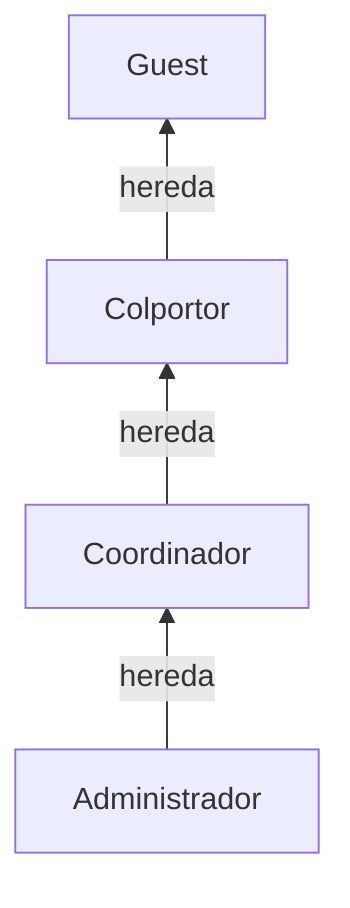
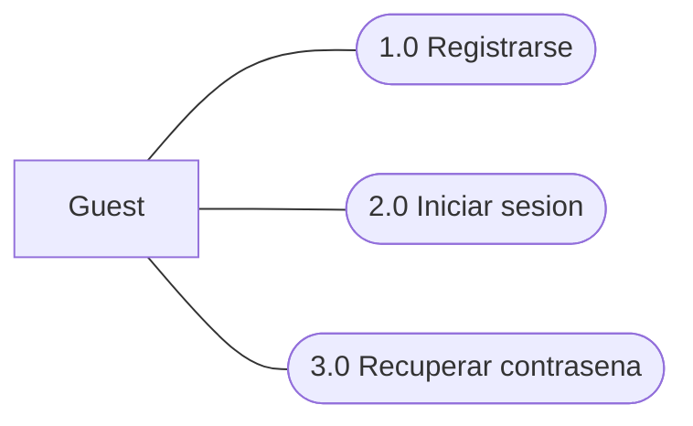
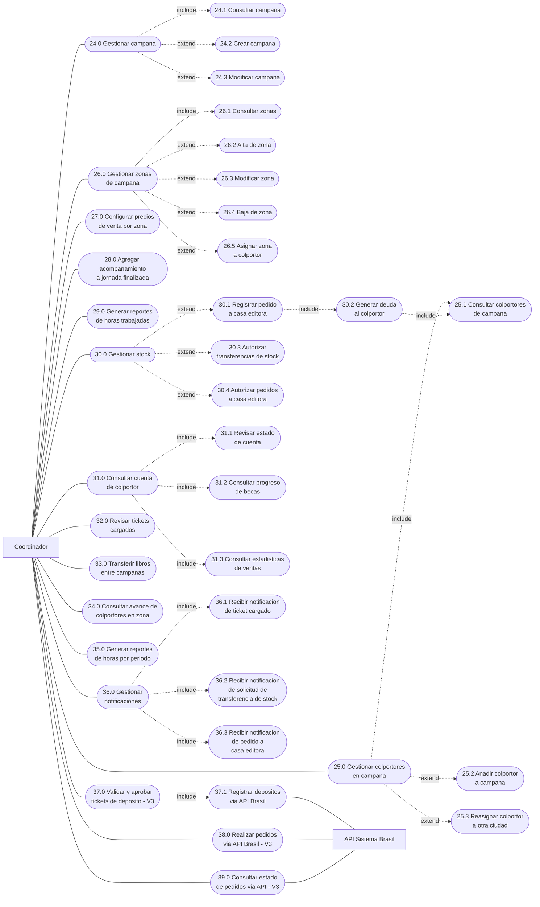
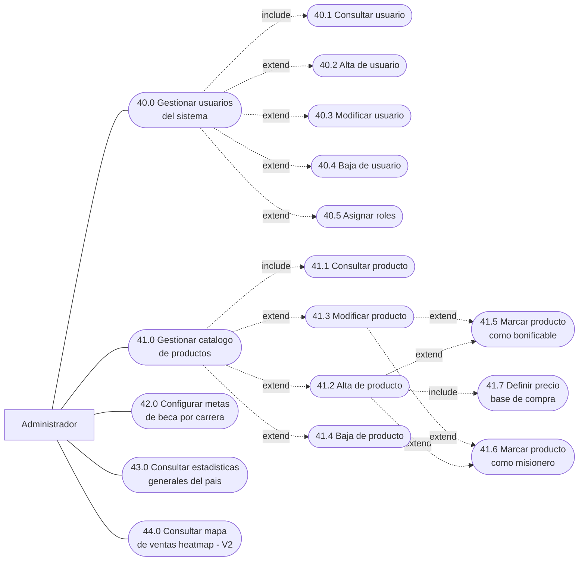

# Casos de Uso UML - Colportaje App
## Diagrama General Estructurado por Roles

Documento generado a partir del IEEE 830 v1.2 y la guia UML Capitulo III - Casos de Uso.

**Actores del sistema:**

| Actor | Descripcion |
|-------|-------------|
| **Guest** | Usuario no autenticado que accede al sistema por primera vez |
| **Colportor** | Persona que realiza venta de literatura puerta a puerta |
| **Coordinador** | Responsable de gestionar un grupo de colportores |
| **Administrador** | Usuario con acceso completo al sistema para gestion global |

**Patron ABM aplicado en gestores:**
- `include` = Consultar (siempre se ejecuta al acceder al gestor)
- `extend` = Alta, Baja, Modificar (se ejecutan opcionalmente desde el gestor)

---

## 1. Jerarquia de Actores (Generalizacion)

> La generalizacion indica herencia: Colportor hereda de Guest, Coordinador hereda de Colportor, Administrador hereda de Coordinador.

---

## 2. Casos de Uso del Guest

---

## 3. Casos de Uso del Colportor

**Flujo principal del colportor:**
1. Iniciar jornada de colportaje (mapa con navegacion, registrar ubicaciones, clientes, ventas, notas)
2. Consultar agenda (visitas programadas en espacios)
3. Consultar clientes y estado de cuenta por cliente
4. Mi cuenta (pedidos, stock, transferencias, beca)

```mermaid
graph LR
    C["Colportor"]

    %% --- Sesion ---
    CU4_0(["4.0 Cerrar sesion"])
    C --- CU4_0

    %% --- Jornada ---
    CU5_0(["5.0 Iniciar jornada<br/>de trabajo"])
    CU5_1(["5.1 Finalizar jornada<br/>de trabajo"])
    CU5_2(["5.2 Indicar<br/>acompanamiento"])
    C --- CU5_0
    C --- CU5_1
    CU5_0 -.->|"extend"| CU5_2
    CU5_1 -.->|"extend"| CU5_2

    %% --- Gestor de Ubicaciones (ABM) ---
    CU6_0(["6.0 Gestionar<br/>ubicaciones"])
    CU6_1(["6.1 Consultar<br/>ubicaciones"])
    CU6_2(["6.2 Alta de ubicacion<br/>Casa/Negocio/Edificio"])
    CU6_3(["6.3 Modificar<br/>ubicacion"])
    CU6_4(["6.4 Baja de<br/>ubicacion"])
    CU6_5(["6.5 Validar duplicacion<br/>de ubicacion"])
    CU6_6(["6.6 Consultar mapa<br/>de ubicaciones"])
    C --- CU6_0
    CU6_0 -.->|"include"| CU6_1
    CU6_0 -.->|"extend"| CU6_2
    CU6_0 -.->|"extend"| CU6_3
    CU6_0 -.->|"extend"| CU6_4
    CU6_2 -.->|"include"| CU6_5
    CU6_1 -.->|"include"| CU6_6

    %% --- Gestor de Espacios (ABM) ---
    CU7_0(["7.0 Gestionar espacios<br/>en ubicacion"])
    CU7_1(["7.1 Consultar<br/>espacios"])
    CU7_2(["7.2 Alta de espacio<br/>en ubicacion"])
    CU7_3(["7.3 Modificar<br/>espacio"])
    CU7_4(["7.4 Baja de<br/>espacio"])
    CU7_5(["7.5 Consultar historial<br/>de visitas del espacio"])
    C --- CU7_0
    CU7_0 -.->|"include"| CU7_1
    CU7_0 -.->|"extend"| CU7_2
    CU7_0 -.->|"extend"| CU7_3
    CU7_0 -.->|"extend"| CU7_4
    CU7_1 -.->|"include"| CU7_5
    CU7_1 -.->|"include"| CU6_1

    %% --- Gestor de Personas / Clientes (ABM) ---
    CU8_0(["8.0 Gestionar personas<br/>en espacio"])
    CU8_1(["8.1 Consultar<br/>personas"])
    CU8_2(["8.2 Alta de persona<br/>en espacio"])
    CU8_3(["8.3 Modificar<br/>persona"])
    CU8_4(["8.4 Baja de<br/>persona"])
    CU8_5(["8.5 Agregar notas<br/>a persona"])
    CU8_6(["8.6 Indicar ubicacion<br/>alt. de cobranza"])
    CU8_7(["8.7 Consultar estado de<br/>cuenta por cliente"])
    CU8_8(["8.8 Agendar visita<br/>de cobranza"])
    C --- CU8_0
    CU8_0 -.->|"include"| CU8_1
    CU8_0 -.->|"extend"| CU8_2
    CU8_0 -.->|"extend"| CU8_3
    CU8_0 -.->|"extend"| CU8_4
    CU8_0 -.->|"extend"| CU8_5
    CU8_0 -.->|"extend"| CU8_6
    CU8_0 -.->|"extend"| CU8_7
    CU8_7 -.->|"extend"| CU8_8
    CU8_8 -.->|"include"| CU9_0
    CU8_1 -.->|"include"| CU7_1

    %% --- Visitas (en espacios) ---
    CU9_0(["9.0 Agendar visita<br/>Entrevista/Cobranza"])
    CU9_1(["9.1 Agendar cobranza<br/>en ubic. alternativa"])
    C --- CU9_0
    CU9_0 -.->|"extend"| CU9_1

    CU10_0(["10.0 Consultar agendas<br/>pendientes"])
    C --- CU10_0

    CU11_0(["11.0 Registrar resultado<br/>de visita"])
    CU11_1(["11.1 Registrar seguimiento<br/>automatico"])
    C --- CU11_0
    CU11_0 -.->|"include"| CU11_1

    %% --- Ventas (en persona-espacio) ---
    CU12_0(["12.0 Registrar venta"])
    CU12_1(["12.1 Consultar precios<br/>de la zona"])
    CU12_2(["12.2 Asociar venta a<br/>persona y espacio"])
    CU12_3(["12.3 Registrar entrega<br/>de materiales"])
    CU12_4(["12.4 Registrar cobro"])
    CU12_5(["12.5 Agendar visita<br/>de seguimiento"])
    C --- CU12_0
    CU12_0 -.->|"include"| CU12_1
    CU12_0 -.->|"include"| CU12_2
    CU12_0 -.->|"extend"| CU12_3
    CU12_0 -.->|"extend"| CU12_4
    CU12_0 -.->|"extend"| CU12_5
    CU12_5 -.->|"include"| CU9_0

    %% --- Cobranzas ---
    CU13_0(["13.0 Registrar cobro"])
    CU13_1(["13.1 Cobro en efectivo"])
    CU13_2(["13.2 Cobro con tarjeta"])
    CU13_3(["13.3 Cobro por<br/>transferencia"])
    CU13_4(["13.4 Calcular saldo<br/>pendiente"])
    CU13_5(["13.5 Cargar imagen<br/>de ticket"])
    C --- CU13_0
    CU13_1 -.->|generalizacion| CU13_0
    CU13_2 -.->|generalizacion| CU13_0
    CU13_3 -.->|generalizacion| CU13_0
    CU13_0 -.->|"include"| CU13_4
    CU13_2 -.->|"extend"| CU13_5

    %% --- Gestionar mi cuenta (agrupa consultas V2) ---
    CU14_0(["14.0 Gestionar<br/>mi cuenta"])
    CU14_1(["14.1 Consultar<br/>deuda total"])
    CU14_2(["14.2 Consultar dinero<br/>depositado"])
    CU14_3(["14.3 Consultar dinero<br/>por cobrar"])
    CU14_4(["14.4 Consultar dinero<br/>en mano - V3"])
    CU14_5(["14.5 Consultar<br/>stock propio"])
    CU14_6(["14.6 Consultar progreso<br/>hacia beca"])
    CU14_7(["14.7 Calcular avance<br/>automatico de beca"])
    C --- CU14_0
    CU14_0 -.->|"include"| CU14_1
    CU14_0 -.->|"include"| CU14_2
    CU14_0 -.->|"include"| CU14_3
    CU14_0 -.->|"include"| CU14_4
    CU14_0 -.->|"include"| CU14_5
    CU14_0 -.->|"include"| CU14_6
    CU14_6 -.->|"include"| CU14_7

    CU15_0(["15.0 Solicitar<br/>transferencia de stock"])
    C --- CU15_0

    CU16_0(["16.0 Registrar deposito<br/>de efectivo"])
    CU16_1(["16.1 Cargar imagen<br/>de comprobante"])
    C --- CU16_0
    CU16_0 -.->|"include"| CU16_1

    %% --- Gestor de Backup y Sincronizacion ---
    CU17_0(["17.0 Gestionar backup<br/>y sincronizacion"])
    CU17_1(["17.1 Configurar proveedor<br/>cloud de backup"])
    CU17_2(["17.2 Forzar<br/>sincronizacion manual"])
    CU17_3(["17.3 Consultar estado de<br/>ultima sincronizacion"])
    CU17_4(["17.4 Activar/desactivar<br/>ahorro de datos"])
    C --- CU17_0
    CU17_0 -.->|"extend"| CU17_1
    CU17_0 -.->|"extend"| CU17_2
    CU17_0 -.->|"include"| CU17_3
    CU17_0 -.->|"extend"| CU17_4

    %% --- Notificaciones ---
    CU18_0(["18.0 Gestionar<br/>notificaciones"])
    CU18_1(["18.1 Recibir recordatorio<br/>de visita agendada"])
    CU18_2(["18.2 Recibir notificacion<br/>de pedido autorizado"])
    C --- CU18_0
    CU18_0 -.->|"include"| CU18_1
    CU18_0 -.->|"include"| CU18_2

    %% --- Pathing V3 ---
    CU19_0(["19.0 Sugerir ruta<br/>optima - V3"])
    CU19_1(["19.1 Integrar con app<br/>de navegacion - V3"])
    C --- CU19_0
    CU19_0 -.->|"extend"| CU19_1

    CU20_0(["20.0 Consultar direcciones<br/>por proximidad - V3"])
    C --- CU20_0

    %% --- Finanzas personales V3 ---
    CU21_0(["21.0 Registrar gastos<br/>personales - V3"])
    C --- CU21_0

    CU22_0(["22.0 Consultar balance<br/>finanzas - V3"])
    C --- CU22_0

    CU23_0(["23.0 Proyectar<br/>ganancia - V3"])
    C --- CU23_0
```

---

## 4. Casos de Uso del Coordinador

---

## 5. Casos de Uso del Administrador

---

## 6. Tabla de Trazabilidad: Caso de Uso a Requisito IEEE 830

### Guest

| CU | Nombre | Requisito IEEE 830 | Version |
|----|--------|-------------------|---------|
| 1.0 | Registrarse | RF-AU01 | V1 |
| 2.0 | Iniciar sesion | RF-AU02 | V1 |
| 3.0 | Recuperar contrasena | RF-AU03 | V1 |

### Colportor

| CU | Nombre | Requisito IEEE 830 | Version |
|----|--------|-------------------|---------|
| 4.0 | Cerrar sesion | RF-AU06 | V1 |
| 5.0 | Iniciar jornada de trabajo | RF-JO01 | V1 |
| 5.1 | Finalizar jornada de trabajo | RF-JO02 | V1 |
| 5.2 | Indicar acompanamiento | RF-JO03 | V1 |
| 6.0 | Gestionar ubicaciones | RF-UB01, RF-UB07 | V1 |
| 6.1 | Consultar ubicaciones | RF-UB01 | V1 |
| 6.2 | Alta de ubicacion | RF-UB01 | V1 |
| 6.3 | Modificar ubicacion | RF-UB07 | V1 |
| 6.4 | Baja de ubicacion | RF-UB07 | V1 |
| 6.5 | Validar duplicacion de ubicacion | RF-UB08 | V1 |
| 6.6 | Consultar mapa de ubicaciones | RF-UB06 | V1 |
| 7.0 | Gestionar espacios en ubicacion | RF-UB03, RF-UB07 | V1 |
| 7.1 | Consultar espacios | RF-UB03 | V1 |
| 7.2 | Alta de espacio en ubicacion | RF-UB03 | V1 |
| 7.3 | Modificar espacio | RF-UB07 | V1 |
| 7.4 | Baja de espacio | RF-UB07 | V1 |
| 7.5 | Consultar historial de visitas del espacio | RF-VI07 | V1 |
| 8.0 | Gestionar personas en espacio | RF-UB04, RF-UB07 | V1 |
| 8.1 | Consultar personas | RF-UB04 | V1 |
| 8.2 | Alta de persona en espacio | RF-UB04 | V1 |
| 8.3 | Modificar persona | RF-UB07 | V1 |
| 8.4 | Baja de persona | RF-UB07 | V1 |
| 8.5 | Agregar notas a persona | RF-VI03 | V1 |
| 8.6 | Indicar ubicacion alt. de cobranza | RF-UB05 | V1 |
| 8.7 | Consultar estado de cuenta por cliente | RF-VE05, RF-EC07 | V2 |
| 8.8 | Agendar visita de cobranza (include a 9.0) | RF-VI01, RF-VI06 | V1 |
| 9.0 | Agendar visita (Entrevista/Cobranza) | RF-VI01 | V1 |
| 9.1 | Agendar cobranza en ubic. alternativa | RF-VI06 | V1 |
| 10.0 | Consultar agendas pendientes | RF-VI04 | V1 |
| 11.0 | Registrar resultado de visita | RF-VI02 | V1 |
| 11.1 | Registrar seguimiento automatico | RF-VI05 | V1 |
| 12.0 | Registrar venta | RF-VE01 | V1 |
| 12.1 | Consultar precios de la zona | RF-PR06 | V1 |
| 12.2 | Asociar venta a persona y espacio | RF-VE02 | V1 |
| 12.3 | Registrar entrega de materiales | RF-VE03, RF-VE04 | V1 |
| 12.4 | Registrar cobro (enlaza a 13.0) | RF-CO01, RF-CO02, RF-CO03 | V1 |
| 12.5 | Agendar visita de seguimiento (include a 9.0) | RF-VI01 | V1 |
| 13.0 | Registrar cobro (caso de uso padre) | RF-CO01, RF-CO02, RF-CO03 | V1 |
| 13.1 | Cobro en efectivo | RF-CO01 | V1 |
| 13.2 | Cobro con tarjeta | RF-CO02 | V1 |
| 13.3 | Cobro por transferencia | RF-CO03 | V1 |
| 13.4 | Calcular saldo pendiente | RF-CO06 | V1 |
| 13.5 | Cargar imagen de ticket | RF-CO05 | V2 |
| 14.0 | Gestionar mi cuenta | RF-EC01 a RF-EC04, RF-ST03, RF-BE03 | V2 |
| 14.1 | Consultar deuda total | RF-EC01 | V2 |
| 14.2 | Consultar dinero depositado | RF-EC02 | V2 |
| 14.3 | Consultar dinero por cobrar | RF-EC04 | V2 |
| 14.4 | Consultar dinero en mano | RF-EC03 | V3 |
| 14.5 | Consultar stock propio | RF-ST03 | V2 |
| 14.6 | Consultar progreso hacia beca | RF-BE03 | V2 |
| 14.7 | Calcular avance automatico de beca | RF-BE02 | V2 |
| 15.0 | Solicitar transferencia de stock | RF-ST04 | V2 |
| 16.0 | Registrar deposito de efectivo | RF-EC06 | V2 |
| 16.1 | Cargar imagen de comprobante | RF-CO05, RF-CO08A | V2 |
| 17.0 | Gestionar backup y sincronizacion | RF-AL03 a RF-AL05, RF-SY05, RF-SY06, RF-SY08 | V1 |
| 17.1 | Configurar proveedor cloud de backup | RF-AL03, RF-AL04, RF-AL05 | V1 |
| 17.2 | Forzar sincronizacion manual | RF-SY05 | V1 |
| 17.3 | Consultar estado de ultima sincronizacion | RF-SY06 | V1 |
| 17.4 | Activar/desactivar ahorro de datos | RF-SY08 | V1 |
| 18.0 | Gestionar notificaciones | RF-NO01, RF-NO02, RF-NO04 | V1 |
| 18.1 | Recibir recordatorio de visita agendada | RF-NO01, RF-NO04 | V1 |
| 18.2 | Recibir notificacion de pedido autorizado | RF-NO02 | V2 |
| 19.0 | Sugerir ruta optima | RF-PA01 | V3 |
| 19.1 | Integrar con app de navegacion | RF-PA03 | V3 |
| 20.0 | Consultar direcciones por proximidad | RF-PA02 | V3 |
| 21.0 | Registrar gastos personales | RF-FI01 | V3 |
| 22.0 | Consultar balance finanzas personales | RF-FI02 | V3 |
| 23.0 | Proyectar ganancia esperada | RF-FI03 | V3 |

### Coordinador

| CU | Nombre | Requisito IEEE 830 | Version |
|----|--------|-------------------|---------|
| 24.0 | Gestionar campana | RF-CA01 | V1 |
| 24.1 | Consultar campana | RF-CA01 | V1 |
| 24.2 | Crear campana | RF-CA01 | V1 |
| 24.3 | Modificar campana | RF-CA01 | V1 |
| 25.0 | Gestionar colportores en campana | RF-CA02, RF-AU04, RF-CA05 | V1 |
| 25.1 | Consultar colportores de campana | RF-CA02 | V1 |
| 25.2 | Anadir colportor a campana | RF-CA02, RF-AU04 | V1 |
| 25.3 | Reasignar colportor a otra ciudad | RF-CA05 | V1 |
| 26.0 | Gestionar zonas de campana | RF-CA03, RF-CA06 | V1 |
| 26.1 | Consultar zonas | RF-CA03, RF-CA06 | V1 |
| 26.2 | Alta de zona | RF-CA06 | V1 |
| 26.3 | Modificar zona | RF-CA06 | V1 |
| 26.4 | Baja de zona | RF-CA06 | V1 |
| 26.5 | Asignar zona a colportor | RF-CA03 | V1 |
| 27.0 | Configurar precios de venta por zona | RF-PR05 | V1 |
| 28.0 | Agregar acompanamiento a jornada finalizada | RF-JO04 | V1 |
| 29.0 | Generar reportes de horas trabajadas | RF-JO05 | V1 |
| 30.0 | Gestionar stock | RF-ST01, RF-ST05, RF-ST06 | V2 |
| 30.1 | Registrar pedido a casa editora | RF-ST01 | V2 |
| 30.2 | Generar deuda al colportor (include a 25.1) | RF-ST02 | V2 |
| 30.3 | Autorizar transferencias de stock | RF-ST05 | V2 |
| 30.4 | Autorizar pedidos a casa editora | RF-ST06 | V2 |
| 31.0 | Consultar cuenta de colportor | RF-EC05, RF-BE04, RF-RE03 | V2 |
| 31.1 | Revisar estado de cuenta | RF-EC05 | V2 |
| 31.2 | Consultar progreso de becas | RF-BE04 | V2 |
| 31.3 | Consultar estadisticas de ventas | RF-RE03 | V1 |
| 32.0 | Revisar tickets cargados | RF-CO07 | V2 |
| 33.0 | Transferir libros entre campanas | RF-BE05 | V2 |
| 34.0 | Consultar avance de colportores en zona | RF-RE01 | V1 |
| 35.0 | Generar reportes de horas por periodo | RF-RE02 | V1 |
| 36.0 | Gestionar notificaciones | RF-NO02, RF-NO03, RF-ST04 | V2 |
| 36.1 | Recibir notificacion de ticket cargado | RF-NO03 | V2 |
| 36.2 | Recibir notificacion de solicitud de transferencia de stock | RF-NO02, RF-ST04 | V2 |
| 36.3 | Recibir notificacion de pedido a casa editora | RF-ST01 | V2 |
| 37.0 | Validar y aprobar tickets de deposito | RF-BR04 | V3 |
| 37.1 | Registrar depositos via API Brasil | RF-BR05 | V3 |
| 38.0 | Realizar pedidos via API Brasil | RF-BR06 | V3 |
| 39.0 | Consultar estado de pedidos via API | RF-BR07 | V3 |

### Administrador

| CU | Nombre | Requisito IEEE 830 | Version |
|----|--------|-------------------|---------|
| 40.0 | Gestionar usuarios del sistema | RF-A01 | V1 |
| 40.1 | Consultar usuario | RF-A01 | V1 |
| 40.2 | Alta de usuario | RF-A01 | V1 |
| 40.3 | Modificar usuario | RF-A01 | V1 |
| 40.4 | Baja de usuario | RF-A01 | V1 |
| 40.5 | Asignar roles | RF-A02, RF-AU05 | V1 |
| 41.0 | Gestionar catalogo de productos | RF-PR01, RF-A05 | V1 |
| 41.1 | Consultar producto | RF-PR01 | V1 |
| 41.2 | Alta de producto | RF-PR01, RF-A05 | V1 |
| 41.3 | Modificar producto | RF-PR01, RF-A05 | V1 |
| 41.4 | Baja de producto | RF-PR01, RF-A05 | V1 |
| 41.5 | Marcar producto como bonificable | RF-PR02 | V1 |
| 41.6 | Marcar producto como misionero | RF-PR03 | V1 |
| 41.7 | Definir precio base de compra | RF-PR04 | V1 |
| 42.0 | Configurar metas de beca por carrera | RF-BE01, RF-A06 | V2 |
| 43.0 | Consultar estadisticas generales del pais | RF-RE04, RF-A04 | V1 |
| 44.0 | Consultar mapa de ventas heatmap | RF-RE05, RF-A07 | V2 |

---

## 7. Cambios respecto al documento anterior

| Cambio | Justificacion |
|--------|--------------|
| Consultar espacios (7.1) include a consultar ubicaciones (6.1) | Para gestionar espacios se necesita primero consultar la ubicacion que los contiene |
| Consultar personas (8.1) include a consultar espacios (7.1) | Para gestionar personas se necesita primero consultar el espacio donde residen |
| Estado de cuenta por cliente (8.7) movido a zona de gestion de personas | El estado de cuenta es por cliente (persona), pertenece a la gestion de clientes |
| Agendar visita de cobranza (8.8) include a agendar visita (9.0) | Agendar una cobranza ES agendar una visita de tipo COBRANZA |
| Agendar visita de seguimiento (12.5) include a agendar visita (9.0) | Agendar un seguimiento ES agendar una visita de tipo ENTREVISTA |
| Visitas posicionadas en contexto de espacios | Las visitas ocurren en espacios, no en ubicaciones ni en personas |
| Generar deuda (30.1) include a consultar colportores (25.1) | Para generar deuda se necesita primero consultar/seleccionar al colportor |
| Estado de cuenta, becas y estadisticas agrupados en cuenta de colportor (33.0) | Son consultas sobre la misma entidad (colportor), agrupadas bajo un gestor padre |
| Transferir libros (35.0) como CU independiente | Es una operacion separada del progreso de becas |
| Eliminado gestionar ciudades del Administrador | Las ciudades no son gestionadas por el administrador en este contexto |
| Renumeracion completa: Guest 1-3, Colportor 4-23, Coordinador 24-39, Administrador 40-44 | Numeracion continua y coherente tras todos los cambios estructurales |
| Stock del Coordinador agrupado bajo gestor (30.0) | Pedidos, autorizaciones de transferencia y autorizaciones de pedidos son sub-casos del mismo gestor |
| Patron ABM consistente: consultar=include, alta/baja/modificar=extend | Consultar siempre se ejecuta al acceder al gestor; las operaciones de escritura son opcionales |
| Terminologia normalizada: "ver"/"visualizar" reemplazado por "consultar" | Consistencia terminologica en todo el documento |
| Registrar pago renombrado a Registrar cobro (13.0) | Unificar terminologia: cobro = pago desde perspectiva del colportor |
| Zonas gestionadas por el Coordinador (26.0), no el Administrador | El coordinador crea y gestiona zonas dentro de su campana |
| Asignar roles (42.5) como extend de gestionar usuarios | Asignar roles es una operacion opcional dentro de la gestion de usuarios |

---

*Documento generado a partir del IEEE 830 v1.2 - Colportaje App y la guia UML Capitulo III - Casos de Uso*
