# Casos de Uso por Módulo - Colportaje App (PlantUML)

Documento simplificado orientado al usuario. Cada módulo agrupa sus gestores y funcionalidades.
Los `<<include>>` solo se muestran cuando un caso de uso reutiliza otro caso de uso de otro módulo o gestor.

**Actores:**

| Actor | Qué hace |
|-------|----------|
| **Guest** | Se registra e inicia sesión |
| **Colportor** | Trabaja en campo: registra casas, visitas, ventas y cobros |
| **Coordinador** | Supervisa colportores, gestiona campañas, stock y cuentas |
| **Administrador** | Configura el sistema: usuarios, catálogo, becas y reportes globales |

---

## 1. Jerarquía de Actores

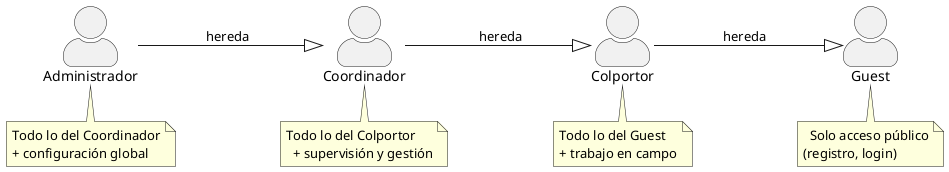

---

## 2. Módulo de Autenticación

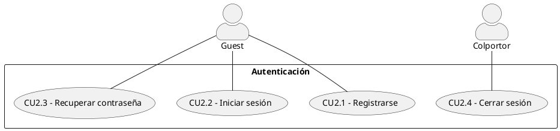

---

## 3. Módulo de Jornada Laboral

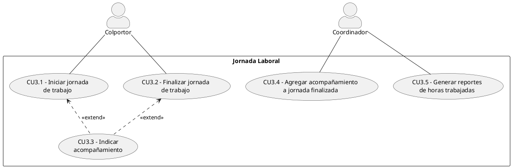

---

## 4. Módulo de Trabajo en Campo

Este es el módulo principal del colportor. El flujo es: abrir el mapa, mover el selector a la ubicación deseada y registrar la casa automáticamente. Sobre esa ubicación se registran visitas, y según el resultado se registra (o no) a la persona.

### 4.1 Gestor de Ubicaciones y Personas

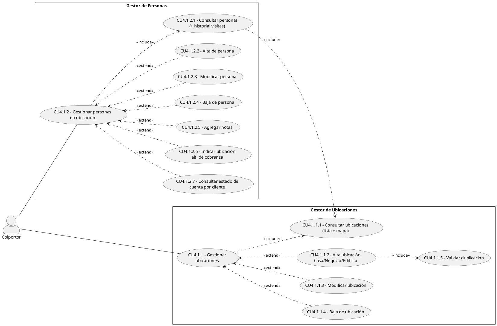

### 4.2 Visitas y Agenda

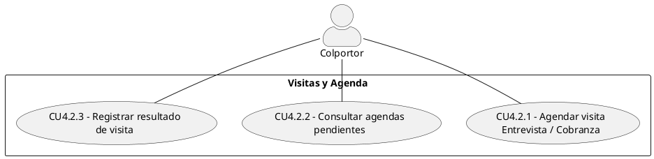

### 4.3 Ventas y Entregas

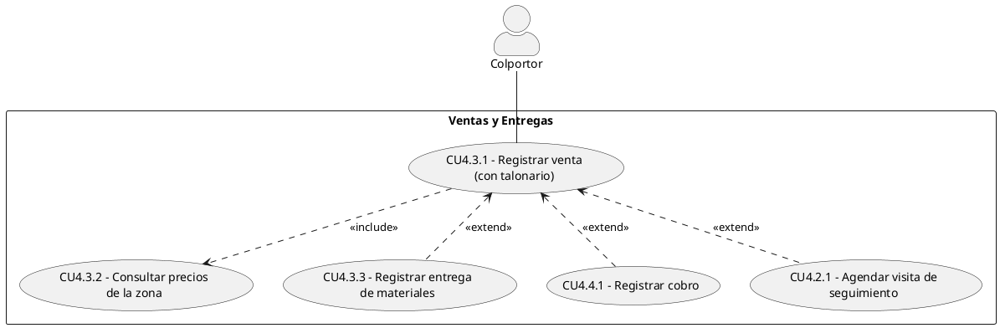

> La visita de seguimiento reutiliza "Agendar visita" (CU4.2.1) del módulo de Visitas. El cobro reutiliza "Registrar cobro" (CU4.4.1) del módulo de Cobranzas.

### 4.4 Cobranzas

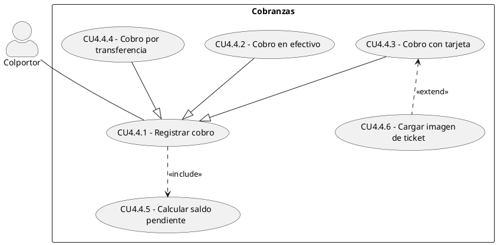

> Los 3 medios de pago son especializaciones (herencia) del caso de uso "Registrar cobro" (CU4.4.1).

---

## 5. Módulo Mi Cuenta (Colportor)

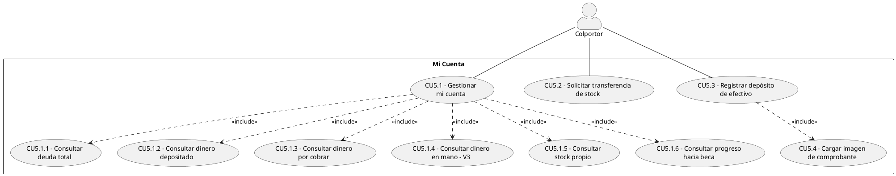

---

## 6. Módulo Backup y Sincronización

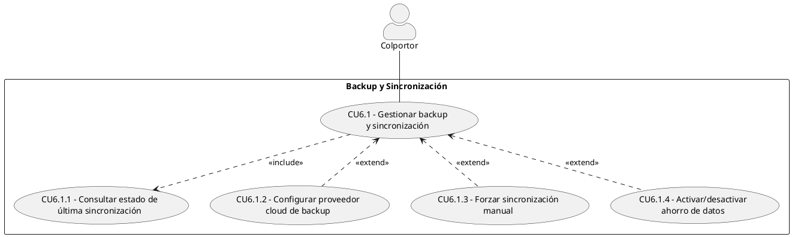

---

## 7. Módulo Notificaciones (Colportor)

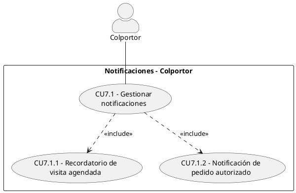

---

## 8. Módulo de Campaña y Zonas (Coordinador)

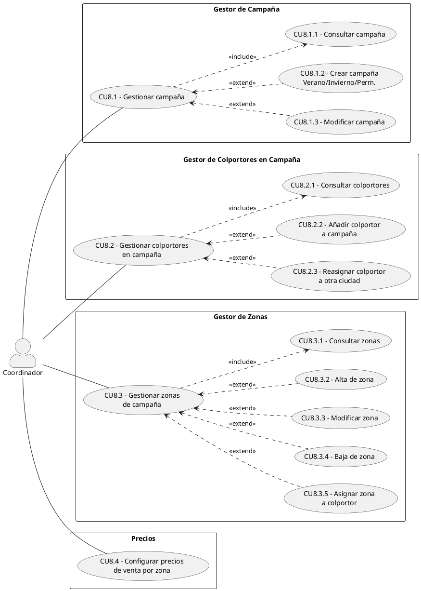

---

## 9. Módulo de Stock (Coordinador)

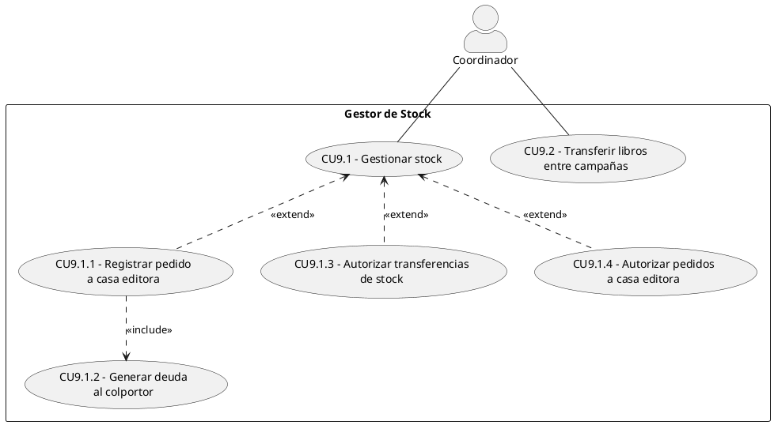

> "Generar deuda" (CU9.1.2) reutiliza "Consultar colportores" (CU8.2.1) del módulo Campaña (<<include>> inter-módulo).

---

## 10. Módulo Cuenta de Colportor (Coordinador)

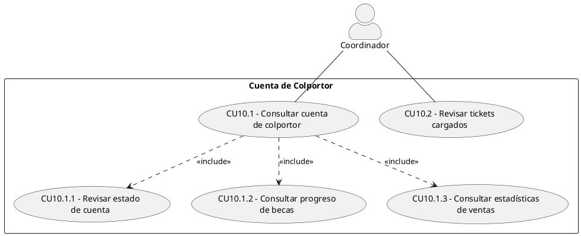

---

## 11. Módulo de Reportes (Coordinador + Admin)

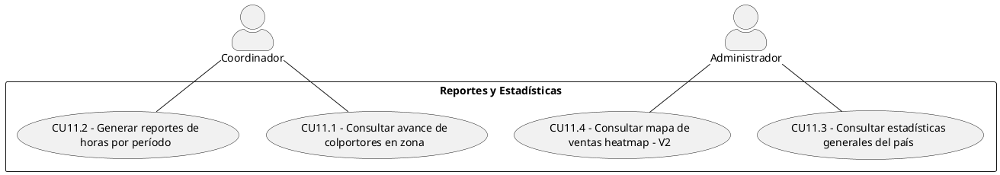

---

## 12. Módulo Notificaciones (Coordinador)

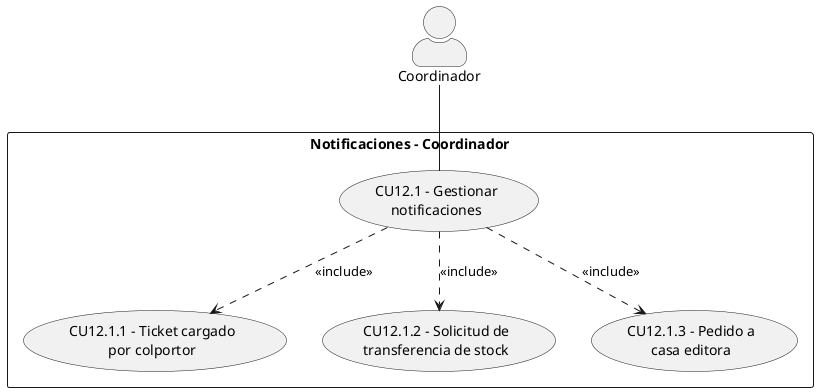

---

## 13. Módulo de Administración (Admin)

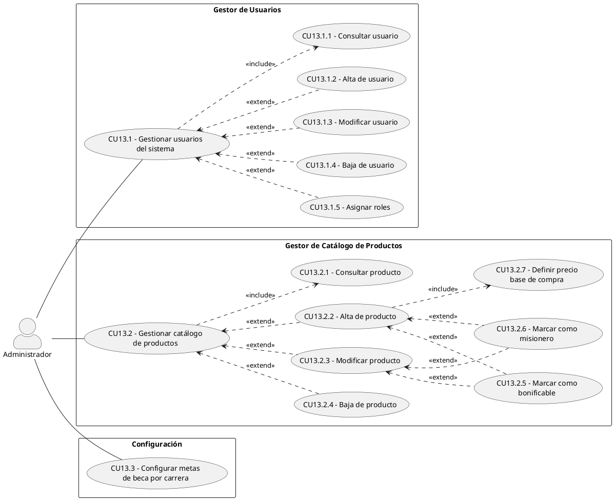

---

## 14. Módulos V3 (Futuros)

### 14.1 Pathing y Navegación

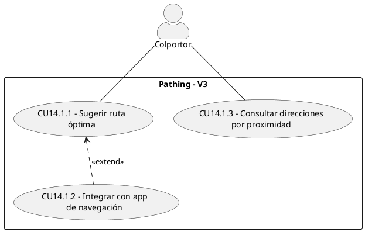

### 14.2 Finanzas Personales

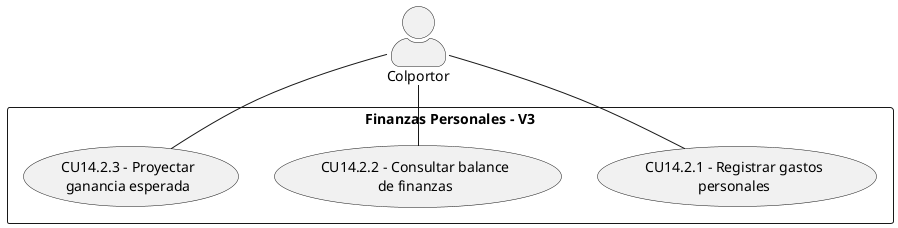

### 14.3 Integración con Sistema Brasil

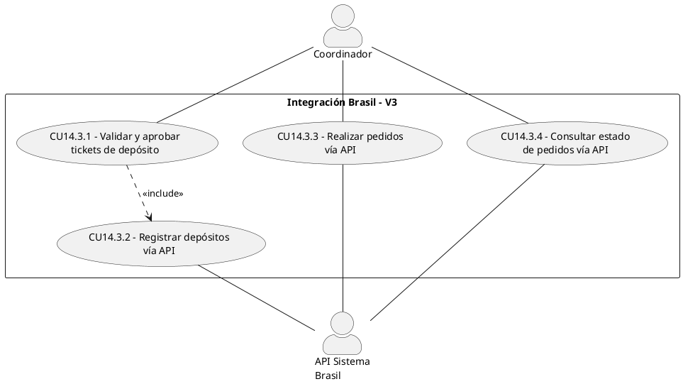

---

## 15. Diagrama Resumen de Paquetes

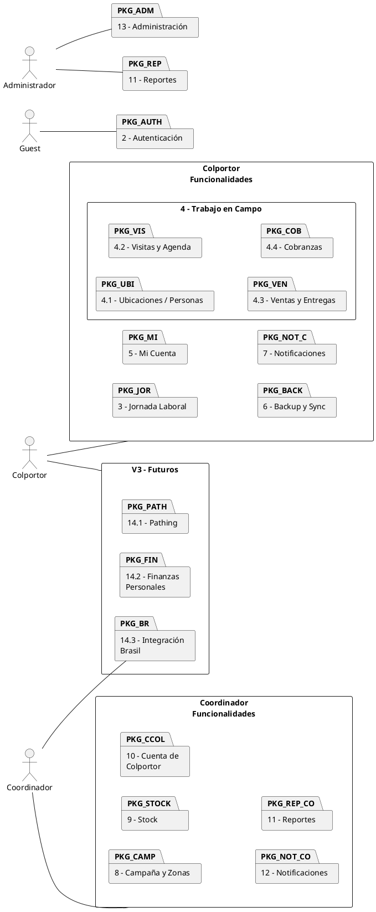

---

## Tabla resumen de numeración CU

| Nro. | Caso de uso | Módulo |
|------|-------------|--------|
| CU2.1 | Registrarse | 2 - Autenticación |
| CU2.2 | Iniciar sesión | 2 - Autenticación |
| CU2.3 | Recuperar contraseña | 2 - Autenticación |
| CU2.4 | Cerrar sesión | 2 - Autenticación |
| CU3.1 | Iniciar jornada de trabajo | 3 - Jornada Laboral |
| CU3.2 | Finalizar jornada de trabajo | 3 - Jornada Laboral |
| CU3.3 | Indicar acompañamiento | 3 - Jornada Laboral |
| CU3.4 | Agregar acompañamiento a jornada finalizada | 3 - Jornada Laboral |
| CU3.5 | Generar reportes de horas trabajadas | 3 - Jornada Laboral |
| CU4.1.1 | Gestionar ubicaciones | 4.1 - Ubicaciones |
| CU4.1.1.1 | Consultar ubicaciones (lista + mapa) | 4.1 - Ubicaciones |
| CU4.1.1.2 | Alta ubicación Casa/Negocio/Edificio | 4.1 - Ubicaciones |
| CU4.1.1.3 | Modificar ubicación | 4.1 - Ubicaciones |
| CU4.1.1.4 | Baja de ubicación | 4.1 - Ubicaciones |
| CU4.1.1.5 | Validar duplicación | 4.1 - Ubicaciones |
| CU4.1.2 | Gestionar personas en ubicación | 4.1 - Personas |
| CU4.1.2.1 | Consultar personas (+ historial visitas) | 4.1 - Personas |
| CU4.1.2.2 | Alta de persona | 4.1 - Personas |
| CU4.1.2.3 | Modificar persona | 4.1 - Personas |
| CU4.1.2.4 | Baja de persona | 4.1 - Personas |
| CU4.1.2.5 | Agregar notas | 4.1 - Personas |
| CU4.1.2.6 | Indicar ubicación alt. de cobranza | 4.1 - Personas |
| CU4.1.2.7 | Consultar estado de cuenta por cliente | 4.1 - Personas |
| CU4.2.1 | Agendar visita Entrevista / Cobranza | 4.2 - Visitas y Agenda |
| CU4.2.2 | Consultar agendas pendientes | 4.2 - Visitas y Agenda |
| CU4.2.3 | Registrar resultado de visita | 4.2 - Visitas y Agenda |
| CU4.3.1 | Registrar venta (con talonario) | 4.3 - Ventas y Entregas |
| CU4.3.2 | Consultar precios de la zona | 4.3 - Ventas y Entregas |
| CU4.3.3 | Registrar entrega de materiales | 4.3 - Ventas y Entregas |
| CU4.4.1 | Registrar cobro | 4.4 - Cobranzas *(reutilizado en 4.3)* |
| CU4.4.2 | Cobro en efectivo | 4.4 - Cobranzas |
| CU4.4.3 | Cobro con tarjeta | 4.4 - Cobranzas |
| CU4.4.4 | Cobro por transferencia | 4.4 - Cobranzas |
| CU4.4.5 | Calcular saldo pendiente | 4.4 - Cobranzas |
| CU4.4.6 | Cargar imagen de ticket | 4.4 - Cobranzas |
| CU5.1 | Gestionar mi cuenta | 5 - Mi Cuenta |
| CU5.1.1 | Consultar deuda total | 5 - Mi Cuenta |
| CU5.1.2 | Consultar dinero depositado | 5 - Mi Cuenta |
| CU5.1.3 | Consultar dinero por cobrar | 5 - Mi Cuenta |
| CU5.1.4 | Consultar dinero en mano (V3) | 5 - Mi Cuenta |
| CU5.1.5 | Consultar stock propio | 5 - Mi Cuenta |
| CU5.1.6 | Consultar progreso hacia beca | 5 - Mi Cuenta |
| CU5.2 | Solicitar transferencia de stock | 5 - Mi Cuenta |
| CU5.3 | Registrar depósito de efectivo | 5 - Mi Cuenta |
| CU5.4 | Cargar imagen de comprobante | 5 - Mi Cuenta |
| CU6.1 | Gestionar backup y sincronización | 6 - Backup y Sync |
| CU6.1.1 | Consultar estado de última sincronización | 6 - Backup y Sync |
| CU6.1.2 | Configurar proveedor cloud de backup | 6 - Backup y Sync |
| CU6.1.3 | Forzar sincronización manual | 6 - Backup y Sync |
| CU6.1.4 | Activar/desactivar ahorro de datos | 6 - Backup y Sync |
| CU7.1 | Gestionar notificaciones (Colportor) | 7 - Notificaciones C |
| CU7.1.1 | Recordatorio de visita agendada | 7 - Notificaciones C |
| CU7.1.2 | Notificación de pedido autorizado | 7 - Notificaciones C |
| CU8.1 | Gestionar campaña | 8 - Campaña y Zonas |
| CU8.1.1 | Consultar campaña | 8 - Campaña y Zonas |
| CU8.1.2 | Crear campaña Verano/Invierno/Perm. | 8 - Campaña y Zonas |
| CU8.1.3 | Modificar campaña | 8 - Campaña y Zonas |
| CU8.2 | Gestionar colportores en campaña | 8 - Campaña y Zonas |
| CU8.2.1 | Consultar colportores | 8 - Campaña y Zonas |
| CU8.2.2 | Añadir colportor a campaña | 8 - Campaña y Zonas |
| CU8.2.3 | Reasignar colportor a otra ciudad | 8 - Campaña y Zonas |
| CU8.3 | Gestionar zonas de campaña | 8 - Campaña y Zonas |
| CU8.3.1 | Consultar zonas | 8 - Campaña y Zonas |
| CU8.3.2 | Alta de zona | 8 - Campaña y Zonas |
| CU8.3.3 | Modificar zona | 8 - Campaña y Zonas |
| CU8.3.4 | Baja de zona | 8 - Campaña y Zonas |
| CU8.3.5 | Asignar zona a colportor | 8 - Campaña y Zonas |
| CU8.4 | Configurar precios de venta por zona | 8 - Campaña y Zonas |
| CU9.1 | Gestionar stock | 9 - Stock |
| CU9.1.1 | Registrar pedido a casa editora | 9 - Stock |
| CU9.1.2 | Generar deuda al colportor | 9 - Stock |
| CU9.1.3 | Autorizar transferencias de stock | 9 - Stock |
| CU9.1.4 | Autorizar pedidos a casa editora | 9 - Stock |
| CU9.2 | Transferir libros entre campañas | 9 - Stock |
| CU10.1 | Consultar cuenta de colportor | 10 - Cuenta Colportor |
| CU10.1.1 | Revisar estado de cuenta | 10 - Cuenta Colportor |
| CU10.1.2 | Consultar progreso de becas | 10 - Cuenta Colportor |
| CU10.1.3 | Consultar estadísticas de ventas | 10 - Cuenta Colportor |
| CU10.2 | Revisar tickets cargados | 10 - Cuenta Colportor |
| CU11.1 | Consultar avance de colportores en zona | 11 - Reportes |
| CU11.2 | Generar reportes de horas por período | 11 - Reportes |
| CU11.3 | Consultar estadísticas generales del país | 11 - Reportes |
| CU11.4 | Consultar mapa de ventas heatmap (V2) | 11 - Reportes |
| CU12.1 | Gestionar notificaciones (Coordinador) | 12 - Notificaciones CO |
| CU12.1.1 | Ticket cargado por colportor | 12 - Notificaciones CO |
| CU12.1.2 | Solicitud de transferencia de stock | 12 - Notificaciones CO |
| CU12.1.3 | Pedido a casa editora | 12 - Notificaciones CO |
| CU13.1 | Gestionar usuarios del sistema | 13 - Administración |
| CU13.1.1 | Consultar usuario | 13 - Administración |
| CU13.1.2 | Alta de usuario | 13 - Administración |
| CU13.1.3 | Modificar usuario | 13 - Administración |
| CU13.1.4 | Baja de usuario | 13 - Administración |
| CU13.1.5 | Asignar roles | 13 - Administración |
| CU13.2 | Gestionar catálogo de productos | 13 - Administración |
| CU13.2.1 | Consultar producto | 13 - Administración |
| CU13.2.2 | Alta de producto | 13 - Administración |
| CU13.2.3 | Modificar producto | 13 - Administración |
| CU13.2.4 | Baja de producto | 13 - Administración |
| CU13.2.5 | Marcar como bonificable | 13 - Administración |
| CU13.2.6 | Marcar como misionero | 13 - Administración |
| CU13.2.7 | Definir precio base de compra | 13 - Administración |
| CU13.3 | Configurar metas de beca por carrera | 13 - Administración |
| CU14.1.1 | Sugerir ruta óptima | 14.1 - Pathing (V3) |
| CU14.1.2 | Integrar con app de navegación | 14.1 - Pathing (V3) |
| CU14.1.3 | Consultar direcciones por proximidad | 14.1 - Pathing (V3) |
| CU14.2.1 | Registrar gastos personales | 14.2 - Finanzas (V3) |
| CU14.2.2 | Consultar balance de finanzas | 14.2 - Finanzas (V3) |
| CU14.2.3 | Proyectar ganancia esperada | 14.2 - Finanzas (V3) |
| CU14.3.1 | Validar y aprobar tickets de depósito | 14.3 - Integración Brasil (V3) |
| CU14.3.2 | Registrar depósitos vía API | 14.3 - Integración Brasil (V3) |
| CU14.3.3 | Realizar pedidos vía API | 14.3 - Integración Brasil (V3) |
| CU14.3.4 | Consultar estado de pedidos vía API | 14.3 - Integración Brasil (V3) |

> **Casos reutilizados:** CU4.2.1 (Agendar visita) se reutiliza en módulo 4.3 como visita de seguimiento. CU4.4.1 (Registrar cobro) se reutiliza en módulo 4.3 como cobro asociado a venta. CU8.2.1 (Consultar colportores) es referenciado por CU9.1.2 del módulo 9 vía <<include>> inter-módulo.
