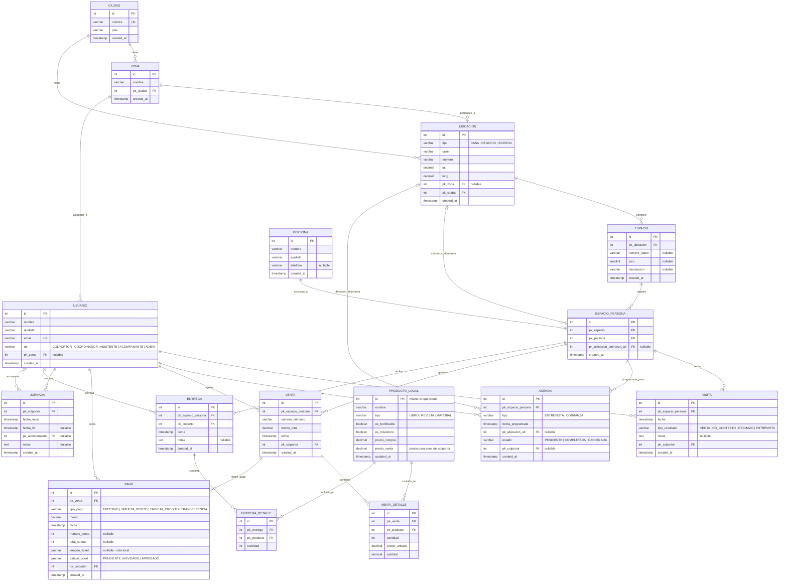

# Diagrama Entidad-Relación — Sistema de Colportaje

**Versión**: 1.0
**Basado en**: IEEE 830 v1.2 (V1 + V2) | `esquema.sql` (borrador local)
**Normalización**: Tercera Forma Normal (3FN)

---

## Notas de Diseño (3FN)

1. **`venta.pk_persona`** del esquema original fue **eliminado** — es derivable vía `pk_espacio_persona → espacio_persona.pk_persona` (dependencia transitiva).
2. **`ubicacion.pk_zona`** se modela como **nullable** según RF-UB02 ("sin asociar obligatoriamente cada ubicación a una zona"). Por eso `pk_ciudad` se mantiene en `ubicacion` (no es transitiva si `pk_zona` es NULL).
3. Se agrega **`venta_detalle`** para RF-VE01 ("registrar venta con productos") — sin ella, la relación venta↔producto sería M:N sin tabla intermedia.
4. Se agrega **`pago`** para RF-CO01–CO06 (pagos individuales: efectivo, tarjeta, transferencia, cuotas).
5. Se agrega **`entrega`** / **`entrega_detalle`** para RF-VE03–VE04 (entregas inmediatas o diferidas de materiales).
6. Se agrega **`jornada`** para RF-JO01–JO05 (jornada laboral con acompañamiento).
7. Se agrega **`producto_local`** como copia local del catálogo cloud (RF-PR08: delta sync).
8. **Cloud** sigue RD-02: sin datos personales de clientes; solo autenticación, estado de ubicaciones, resultados agregados, stock, movimientos y estado de cuenta.

---

## 1. Modelo LOCAL (dispositivo del colportor)

Almacena datos personales de clientes, historial detallado, materiales entregados, saldos y fotos de tickets (RD-01).

---

## 2. Modelo CLOUD (backend administrado)

Sin datos personales de clientes (RD-02, RD-07). Gestiona autenticación, campañas, catálogo, stock, estado de cuenta y ubicaciones agregadas.

```mermaid
erDiagram
    %% ============================================================
    %% MODELO CLOUD — Backend Administrado
    %% Sin datos personales de clientes (RD-02, RD-07)
    %% ============================================================

    C_USUARIO {
        int id PK
        varchar nombre
        varchar apellido
        varchar email UK
        varchar password_hash
        varchar rol "COLPORTOR | COORDINADOR | ASISTENTE | ACOMPANANTE | ADMIN"
        int pk_zona FK "nullable"
        boolean activo
        timestamp ultimo_login "nullable"
        timestamp created_at
    }

    C_CIUDAD {
        int id PK
        varchar nombre UK
        varchar pais
    }

    C_ZONA {
        int id PK
        varchar nombre
        int pk_ciudad FK
    }

    C_CAMPANA {
        int id PK
        varchar nombre
        varchar tipo "VERANO | INVIERNO | PERMANENTE"
        date fecha_inicio
        date fecha_fin
        int pk_coordinador FK
        timestamp created_at
    }

    C_CAMPANA_COLPORTOR {
        int id PK
        int pk_campana FK
        int pk_colportor FK
        int pk_zona FK
    }

    C_PRODUCTO {
        int id PK
        varchar nombre
        varchar tipo "LIBRO | REVISTA | MATERIAL"
        boolean es_bonificable
        boolean es_misionero
        decimal precio_compra
        boolean activo
        timestamp created_at
        timestamp updated_at
    }

    C_COLECCION {
        int id PK
        varchar nombre
        varchar descripcion "nullable"
        timestamp created_at
    }

    C_COLECCION_PRODUCTO {
        int pk_coleccion FK
        int pk_producto FK
    }

    C_PRECIO_ZONA {
        int id PK
        int pk_producto FK
        int pk_zona FK
        decimal precio_venta
        timestamp updated_at
    }

    C_STOCK {
        int id PK
        int pk_colportor FK
        int pk_producto FK
        int cantidad
        timestamp updated_at
    }

    C_PEDIDO {
        int id PK
        int pk_colportor FK
        int pk_coordinador FK "nullable - quien autoriza"
        varchar estado "PENDIENTE | AUTORIZADO | RECHAZADO | DESPACHADO | RECIBIDO"
        decimal monto_total
        timestamp created_at
    }

    C_PEDIDO_DETALLE {
        int id PK
        int pk_pedido FK
        int pk_producto FK
        int cantidad
        decimal precio_unitario
    }

    C_TRANSFERENCIA_STOCK {
        int id PK
        int pk_producto FK
        int pk_origen FK "colportor origen"
        int pk_destino FK "colportor destino"
        int cantidad
        varchar estado "SOLICITADA | AUTORIZADA | RECHAZADA | COMPLETADA"
        int pk_coordinador FK "nullable"
        timestamp created_at
    }

    C_MOVIMIENTO {
        int id PK
        int pk_colportor FK
        varchar tipo "CARGO_PEDIDO | DEPOSITO_EFECTIVO | DEPOSITO_TARJETA | ABONO_VENTA | TRANSFERENCIA"
        decimal monto "positivo=abono negativo=cargo"
        varchar referencia "nullable - num talonario, ID pedido, etc"
        timestamp fecha
        timestamp created_at
    }

    C_UBICACION_ESTADO {
        int id PK
        decimal lat
        decimal long
        varchar tipo "CASA | NEGOCIO | EDIFICIO"
        varchar ultimo_resultado "VENTA | NO_CONTESTO | RECHAZO | ENTREVISTA"
        timestamp fecha_ultima_visita "nullable"
        int pk_zona FK "nullable"
        int pk_colportor FK
        timestamp updated_at
    }

    C_BECA_CONFIG {
        int id PK
        varchar carrera
        int meta_libros_media_beca
        int meta_libros_beca_completa
        int pk_campana FK
    }

    C_BECA_PROGRESO {
        int id PK
        int pk_colportor FK
        int pk_beca_config FK
        int libros_bonificables_vendidos
        timestamp updated_at
    }

    C_NOTIFICACION {
        int id PK
        int pk_usuario_destino FK
        varchar tipo "RECORDATORIO_VISITA | PEDIDO_AUTORIZADO | TICKET_CARGADO | CUOTA_PENDIENTE"
        varchar titulo
        text mensaje
        boolean leida
        timestamp created_at
    }

    C_SYNC_LOG {
        int id PK
        int pk_usuario FK
        timestamp ultima_sync
        int registros_enviados
        int registros_recibidos
    }

    %% === RELACIONES ===

    C_CIUDAD ||--o{ C_ZONA : "tiene"
    C_ZONA ||--o{ C_USUARIO : "asignado_a"
    C_ZONA ||--o{ C_UBICACION_ESTADO : "contiene"
    C_ZONA ||--o{ C_PRECIO_ZONA : "define_precio"
    C_ZONA ||--o{ C_CAMPANA_COLPORTOR : "zona_asignada"

    C_USUARIO ||--o{ C_CAMPANA : "coordina"
    C_USUARIO ||--o{ C_CAMPANA_COLPORTOR : "participa_en"
    C_USUARIO ||--o{ C_STOCK : "posee"
    C_USUARIO ||--o{ C_PEDIDO : "solicita"
    C_USUARIO ||--o{ C_PEDIDO : "autoriza"
    C_USUARIO ||--o{ C_MOVIMIENTO : "registra"
    C_USUARIO ||--o{ C_UBICACION_ESTADO : "reporta"
    C_USUARIO ||--o{ C_BECA_PROGRESO : "avanza"
    C_USUARIO ||--o{ C_NOTIFICACION : "recibe"
    C_USUARIO ||--o{ C_SYNC_LOG : "sincroniza"
    C_USUARIO ||--o{ C_TRANSFERENCIA_STOCK : "origen"
    C_USUARIO ||--o{ C_TRANSFERENCIA_STOCK : "destino"
    C_USUARIO ||--o{ C_TRANSFERENCIA_STOCK : "autoriza"

    C_CAMPANA ||--o{ C_CAMPANA_COLPORTOR : "incluye"
    C_CAMPANA ||--o{ C_BECA_CONFIG : "define"

    C_PRODUCTO ||--o{ C_COLECCION_PRODUCTO : "pertenece_a"
    C_PRODUCTO ||--o{ C_PRECIO_ZONA : "tiene_precio"
    C_PRODUCTO ||--o{ C_STOCK : "almacenado"
    C_PRODUCTO ||--o{ C_PEDIDO_DETALLE : "pedido_en"
    C_PRODUCTO ||--o{ C_TRANSFERENCIA_STOCK : "transferido"

    C_COLECCION ||--o{ C_COLECCION_PRODUCTO : "agrupa"

    C_PEDIDO ||--o{ C_PEDIDO_DETALLE : "contiene"

    C_BECA_CONFIG ||--o{ C_BECA_PROGRESO : "evalua"
```

---

## 3. Mapeo Local ↔ Cloud (sincronización)

| Entidad Local | Sincroniza con Cloud | Datos que viajan |
|---|---|---|
| `USUARIO` | `C_USUARIO` | ID, rol, zona (auth gestionada en cloud) |
| `PRODUCTO_LOCAL` | `C_PRODUCTO` + `C_PRECIO_ZONA` | Catálogo completo + precio de zona (delta sync) |
| `UBICACION` | `C_UBICACION_ESTADO` | Solo lat/long, tipo, último resultado (sin dirección ni personas) |
| `VISITA` | `C_UBICACION_ESTADO` | Resultado agregado y fecha (sin notas personales) |
| `VENTA` | `C_MOVIMIENTO` | Monto como abono; número talonario como referencia |
| `PAGO` (tarjeta) | `C_MOVIMIENTO` | Monto como depósito tarjeta |
| `JORNADA` | — | Solo estadísticas agregadas (horas por período) |
| (stock descontado) | `C_STOCK` | Cantidad actualizada tras entregas |

> **Nota**: Los datos personales (`PERSONA`, `ESPACIO_PERSONA`, notas de visita, imágenes de tickets) **nunca** se sincronizan al cloud (RD-01).

---

## 4. Trazabilidad IEEE 830

| Tabla | Requisitos IEEE 830 |
|---|---|
| **LOCAL** | |
| `CIUDAD`, `ZONA` | RF-CA06 |
| `UBICACION` | RF-UB01, RF-UB02, RF-UB06, RF-UB08 |
| `ESPACIO` | RF-UB03 |
| `PERSONA` | RF-UB04 |
| `ESPACIO_PERSONA` | RF-UB04, RF-UB05 |
| `USUARIO` | RF-AU01–AU06 |
| `VISITA` | RF-VI02, RF-VI03, RF-VI05, RF-VI07 |
| `AGENDA` | RF-VI01, RF-VI04, RF-VI06 |
| `VENTA` + `VENTA_DETALLE` | RF-VE01, RF-VE02 |
| `PAGO` | RF-CO01–CO06, RF-CO08A |
| `ENTREGA` + `ENTREGA_DETALLE` | RF-VE03, RF-VE04, RF-VE05 |
| `JORNADA` | RF-JO01–JO05 |
| `PRODUCTO_LOCAL` | RF-PR06, RF-PR08 |
| **CLOUD** | |
| `C_CAMPANA` + `C_CAMPANA_COLPORTOR` | RF-CA01–CA05 |
| `C_PRODUCTO` + `C_COLECCION` + `C_PRECIO_ZONA` | RF-PR01–PR07 |
| `C_STOCK` | RF-ST03, RF-ST08 |
| `C_PEDIDO` + `C_PEDIDO_DETALLE` | RF-ST01, RF-ST02, RF-ST06 |
| `C_TRANSFERENCIA_STOCK` | RF-ST04, RF-ST05 |
| `C_MOVIMIENTO` | RF-EC01–EC06 |
| `C_BECA_CONFIG` + `C_BECA_PROGRESO` | RF-BE01–BE05 |
| `C_UBICACION_ESTADO` | RF-RE01, RF-RE03, RF-RE05 |
| `C_NOTIFICACION` | RF-NO01–NO04 |
| `C_SYNC_LOG` | RF-SY01–SY06 |
