# Diagramas de Casos de Uso UML - Colportaje App

Diagramas generados a partir del IEEE 830 v1.2 y la guia de Casos de Uso UML (Unidad 3).

**Actores del sistema:**
- **Guest**: Usuario no autenticado
- **Colportor**: Persona que realiza venta de literatura puerta a puerta
- **Coordinador**: Responsable de gestionar un grupo de colportores
- **Administrador**: Usuario con acceso completo al sistema para gestion global

---

## Diagrama General de Actores (Generalizacion)

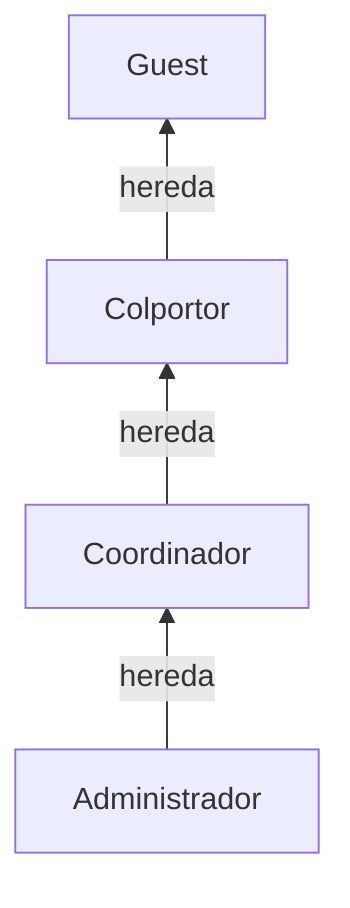
```mermaid
graph BT
    Guest["Guest"]
    Colportor["Colportor"]
    Coordinador["Coordinador"]
    Administrador["Administrador"]

    Colportor -->|hereda| Guest
    Coordinador -->|hereda| Colportor
    Administrador -->|hereda| Coordinador
```

> **Nota:** La jerarquia de generalizacion indica que un Coordinador hereda los casos de uso del Colportor, y el Administrador hereda los del Coordinador. El Guest solo accede a funciones de autenticacion.

---

## 1. Modulo de Autenticacion y Usuarios (V1)

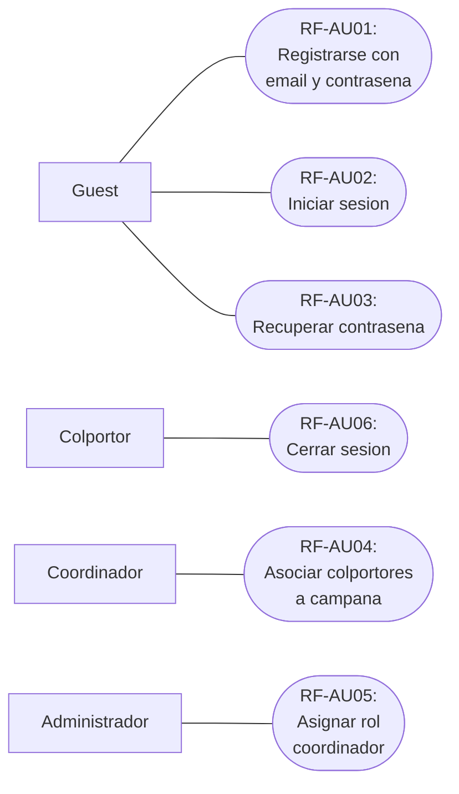
```mermaid
graph LR
    Guest["Guest"]
    Colportor["Colportor"]
    Coordinador["Coordinador"]
    Administrador["Administrador"]

    UC_AU01(["RF-AU01:<br/>Registrarse con<br/>email y contrasena"])
    UC_AU02(["RF-AU02:<br/>Iniciar sesion"])
    UC_AU03(["RF-AU03:<br/>Recuperar contrasena"])
    UC_AU06(["RF-AU06:<br/>Cerrar sesion"])
    UC_AU04(["RF-AU04:<br/>Asociar colportores<br/>a campana"])
    UC_AU05(["RF-AU05:<br/>Asignar rol<br/>coordinador"])

    Guest --- UC_AU01
    Guest --- UC_AU02
    Guest --- UC_AU03
    Colportor --- UC_AU06
    Coordinador --- UC_AU04
    Administrador --- UC_AU05
```

---

## 2. Modulo de Gestion de Ubicaciones (V1)

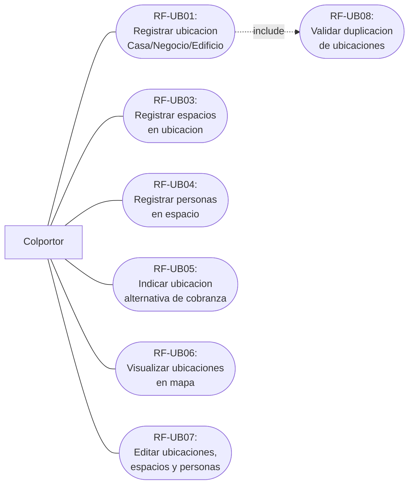
```mermaid
graph LR
    Colportor["Colportor"]

    UC_UB01(["RF-UB01:<br/>Registrar ubicacion<br/>Casa/Negocio/Edificio"])
    UC_UB03(["RF-UB03:<br/>Registrar espacios<br/>en ubicacion"])
    UC_UB04(["RF-UB04:<br/>Registrar personas<br/>en espacio"])
    UC_UB05(["RF-UB05:<br/>Indicar ubicacion<br/>alternativa de cobranza"])
    UC_UB06(["RF-UB06:<br/>Visualizar ubicaciones<br/>en mapa"])
    UC_UB07(["RF-UB07:<br/>Editar ubicaciones,<br/>espacios y personas"])
    UC_UB08(["RF-UB08:<br/>Validar duplicacion<br/>de ubicaciones"])

    Colportor --- UC_UB01
    Colportor --- UC_UB03
    Colportor --- UC_UB04
    Colportor --- UC_UB05
    Colportor --- UC_UB06
    Colportor --- UC_UB07

    UC_UB01 -.->|"include"| UC_UB08
```

---

## 3. Modulo de Visitas y Agenda (V1)

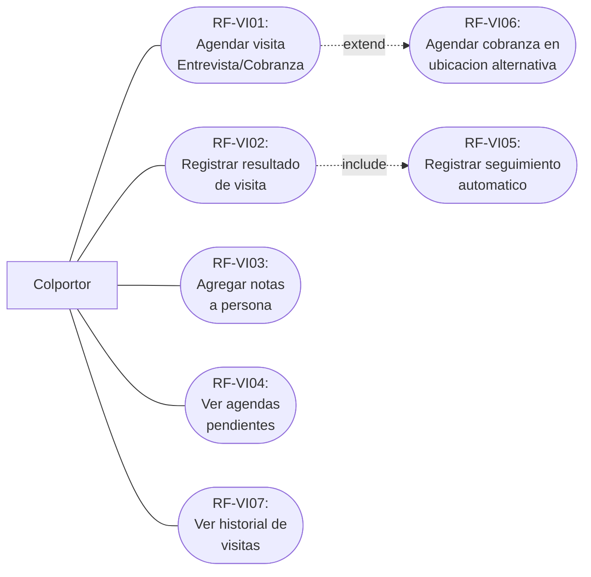
```mermaid
graph LR
    Colportor["Colportor"]

    UC_VI01(["RF-VI01:<br/>Agendar visita<br/>Entrevista/Cobranza"])
    UC_VI02(["RF-VI02:<br/>Registrar resultado<br/>de visita"])
    UC_VI03(["RF-VI03:<br/>Agregar notas<br/>a persona"])
    UC_VI04(["RF-VI04:<br/>Ver agendas<br/>pendientes"])
    UC_VI05(["RF-VI05:<br/>Registrar seguimiento<br/>automatico"])
    UC_VI06(["RF-VI06:<br/>Agendar cobranza en<br/>ubicacion alternativa"])
    UC_VI07(["RF-VI07:<br/>Ver historial de<br/>visitas"])

    Colportor --- UC_VI01
    Colportor --- UC_VI02
    Colportor --- UC_VI03
    Colportor --- UC_VI04
    Colportor --- UC_VI07

    UC_VI02 -.->|"include"| UC_VI05
    UC_VI01 -.->|"extend"| UC_VI06
```

---

## 4. Modulo de Ventas y Entregas (V1-V2)

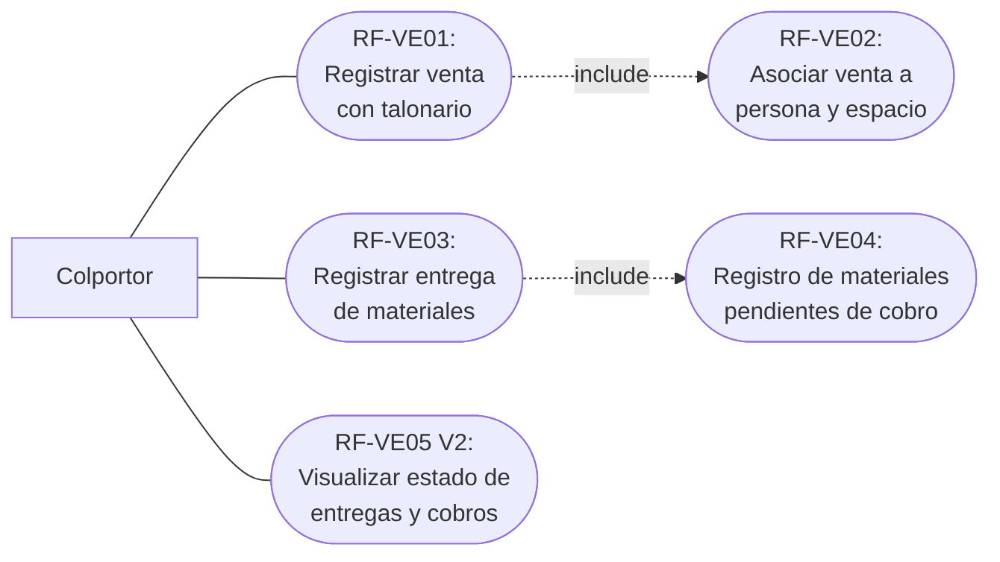
```mermaid
graph LR
    Colportor["Colportor"]

    UC_VE01(["RF-VE01:<br/>Registrar venta<br/>con talonario"])
    UC_VE02(["RF-VE02:<br/>Asociar venta a<br/>persona y espacio"])
    UC_VE03(["RF-VE03:<br/>Registrar entrega<br/>de materiales"])
    UC_VE04(["RF-VE04:<br/>Registro de materiales<br/>pendientes de cobro"])
    UC_VE05(["RF-VE05 V2:<br/>Visualizar estado de<br/>entregas y cobros"])

    Colportor --- UC_VE01
    Colportor --- UC_VE03
    Colportor --- UC_VE05

    UC_VE01 -.->|"include"| UC_VE02
    UC_VE03 -.->|"include"| UC_VE04
```

---

## 5. Modulo de Cobranzas (V1-V2)

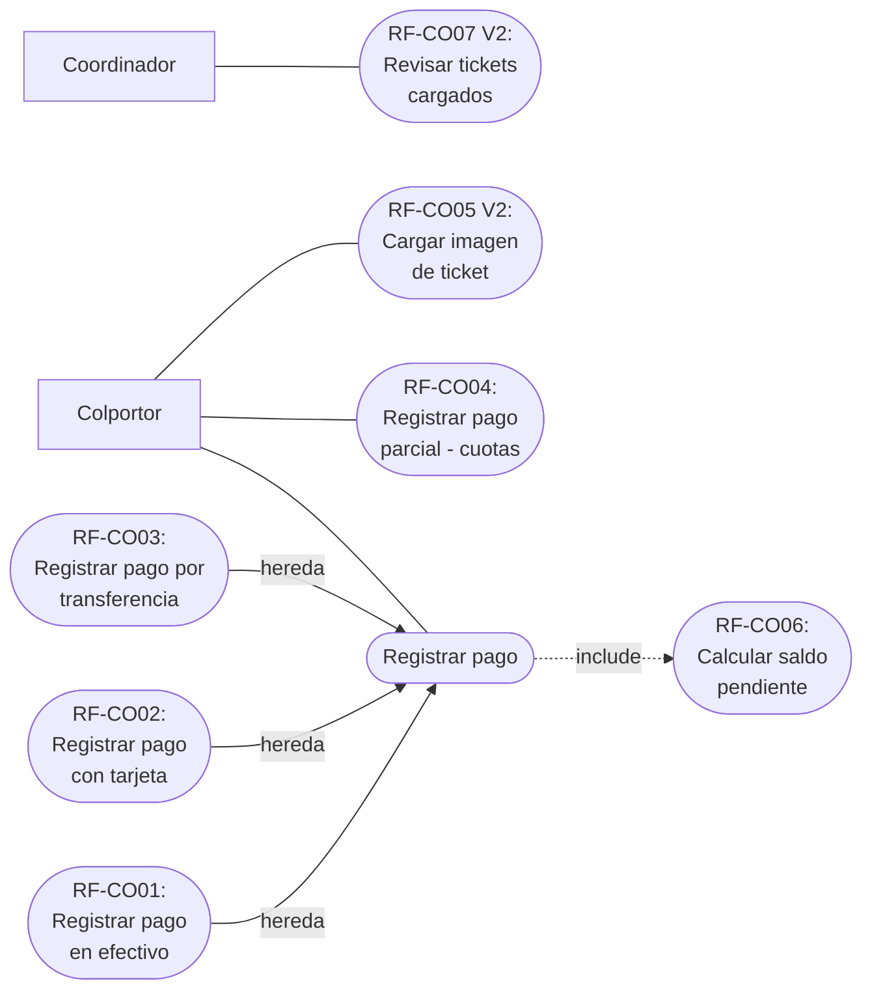
```mermaid
graph LR
    Colportor["Colportor"]
    Coordinador["Coordinador"]

    UC_CO01(["RF-CO01:<br/>Registrar pago<br/>en efectivo"])
    UC_CO02(["RF-CO02:<br/>Registrar pago<br/>con tarjeta"])
    UC_CO03(["RF-CO03:<br/>Registrar pago por<br/>transferencia"])
    UC_CO04(["RF-CO04:<br/>Registrar pago<br/>parcial - cuotas"])
    UC_CO05(["RF-CO05 V2:<br/>Cargar imagen<br/>de ticket"])
    UC_CO06(["RF-CO06:<br/>Calcular saldo<br/>pendiente"])
    UC_CO07(["RF-CO07 V2:<br/>Revisar tickets<br/>cargados"])

    UC_REG_PAGO(["Registrar pago"])

    Colportor --- UC_REG_PAGO
    Colportor --- UC_CO04
    Colportor --- UC_CO05

    UC_CO01 -->|hereda| UC_REG_PAGO
    UC_CO02 -->|hereda| UC_REG_PAGO
    UC_CO03 -->|hereda| UC_REG_PAGO

    UC_REG_PAGO -.->|"include"| UC_CO06

    Coordinador --- UC_CO07
```

---

## 6. Modulo de Jornada Laboral (V1)

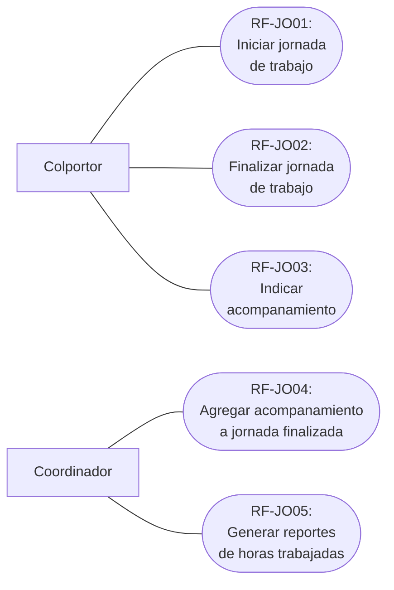
```mermaid
graph LR
    Colportor["Colportor"]
    Coordinador["Coordinador"]

    UC_JO01(["RF-JO01:<br/>Iniciar jornada<br/>de trabajo"])
    UC_JO02(["RF-JO02:<br/>Finalizar jornada<br/>de trabajo"])
    UC_JO03(["RF-JO03:<br/>Indicar<br/>acompanamiento"])
    UC_JO04(["RF-JO04:<br/>Agregar acompanamiento<br/>a jornada finalizada"])
    UC_JO05(["RF-JO05:<br/>Generar reportes<br/>de horas trabajadas"])

    Colportor --- UC_JO01
    Colportor --- UC_JO02
    Colportor --- UC_JO03
    Coordinador --- UC_JO04
    Coordinador --- UC_JO05
```

---

## 7. Modulo de Campanas y Zonas (V1)

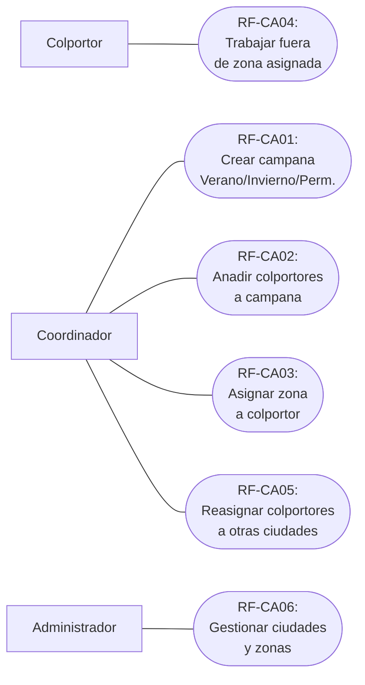
```mermaid
graph LR
    Colportor["Colportor"]
    Coordinador["Coordinador"]
    Administrador["Administrador"]

    UC_CA01(["RF-CA01:<br/>Crear campana<br/>Verano/Invierno/Perm."])
    UC_CA02(["RF-CA02:<br/>Anadir colportores<br/>a campana"])
    UC_CA03(["RF-CA03:<br/>Asignar zona<br/>a colportor"])
    UC_CA04(["RF-CA04:<br/>Trabajar fuera<br/>de zona asignada"])
    UC_CA05(["RF-CA05:<br/>Reasignar colportores<br/>a otras ciudades"])
    UC_CA06(["RF-CA06:<br/>Gestionar ciudades<br/>y zonas"])

    Coordinador --- UC_CA01
    Coordinador --- UC_CA02
    Coordinador --- UC_CA03
    Coordinador --- UC_CA05
    Colportor --- UC_CA04
    Administrador --- UC_CA06
```

---

## 8. Modulo de Precios y Catalogo (V1)

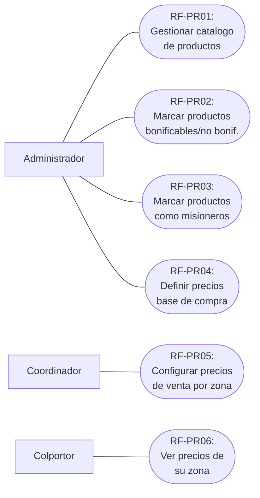
```mermaid
graph LR
    Administrador["Administrador"]
    Coordinador["Coordinador"]
    Colportor["Colportor"]

    UC_PR01(["RF-PR01:<br/>Gestionar catalogo<br/>de productos"])
    UC_PR02(["RF-PR02:<br/>Marcar productos<br/>bonificables/no bonif."])
    UC_PR03(["RF-PR03:<br/>Marcar productos<br/>como misioneros"])
    UC_PR04(["RF-PR04:<br/>Definir precios<br/>base de compra"])
    UC_PR05(["RF-PR05:<br/>Configurar precios<br/>de venta por zona"])
    UC_PR06(["RF-PR06:<br/>Ver precios de<br/>su zona"])

    Administrador --- UC_PR01
    Administrador --- UC_PR02
    Administrador --- UC_PR03
    Administrador --- UC_PR04
    Coordinador --- UC_PR05
    Colportor --- UC_PR06
```

---

## 9. Modulo de Stock (V2)

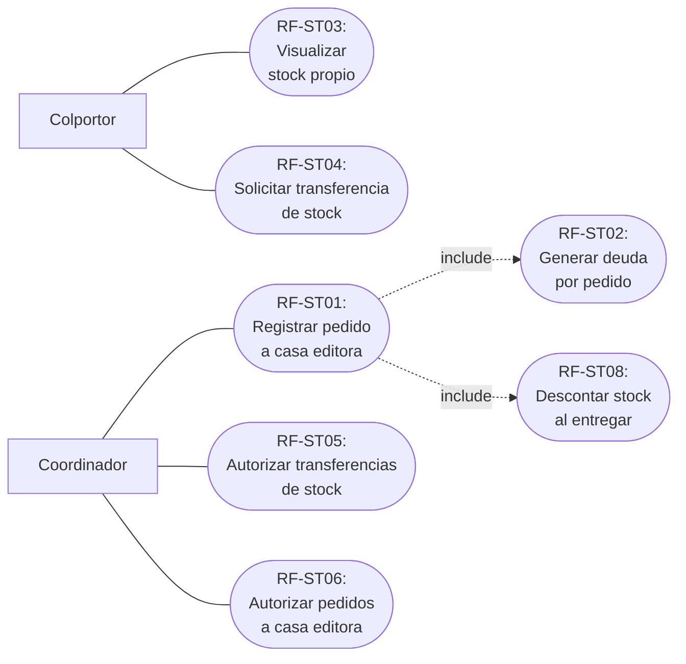
```mermaid
graph LR
    Colportor["Colportor"]
    Coordinador["Coordinador"]

    UC_ST01(["RF-ST01:<br/>Registrar pedido<br/>a casa editora"])
    UC_ST02(["RF-ST02:<br/>Generar deuda<br/>por pedido"])
    UC_ST03(["RF-ST03:<br/>Visualizar<br/>stock propio"])
    UC_ST04(["RF-ST04:<br/>Solicitar transferencia<br/>de stock"])
    UC_ST05(["RF-ST05:<br/>Autorizar transferencias<br/>de stock"])
    UC_ST06(["RF-ST06:<br/>Autorizar pedidos<br/>a casa editora"])
    UC_ST08(["RF-ST08:<br/>Descontar stock<br/>al entregar"])

    Colportor --- UC_ST03
    Colportor --- UC_ST04
    Coordinador --- UC_ST01
    Coordinador --- UC_ST05
    Coordinador --- UC_ST06

    UC_ST01 -.->|"include"| UC_ST02
    UC_ST01 -.->|"include"| UC_ST08
```

---

## 10. Modulo de Estado de Cuenta (V2)

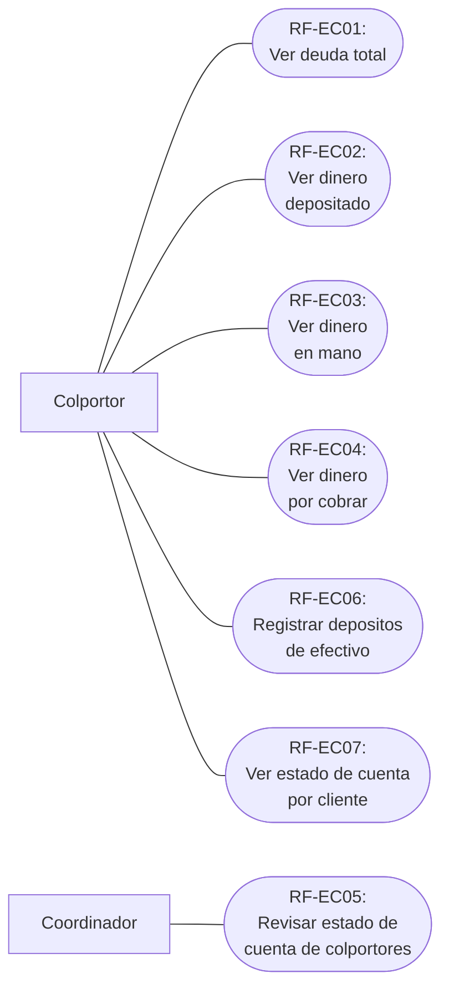
```mermaid
graph LR
    Colportor["Colportor"]
    Coordinador["Coordinador"]

    UC_EC01(["RF-EC01:<br/>Ver deuda total"])
    UC_EC02(["RF-EC02:<br/>Ver dinero<br/>depositado"])
    UC_EC03(["RF-EC03:<br/>Ver dinero<br/>en mano"])
    UC_EC04(["RF-EC04:<br/>Ver dinero<br/>por cobrar"])
    UC_EC05(["RF-EC05:<br/>Revisar estado de<br/>cuenta de colportores"])
    UC_EC06(["RF-EC06:<br/>Registrar depositos<br/>de efectivo"])
    UC_EC07(["RF-EC07:<br/>Ver estado de cuenta<br/>por cliente"])

    Colportor --- UC_EC01
    Colportor --- UC_EC02
    Colportor --- UC_EC03
    Colportor --- UC_EC04
    Colportor --- UC_EC06
    Colportor --- UC_EC07
    Coordinador --- UC_EC05
```

---

## 11. Modulo de Becas (V2)

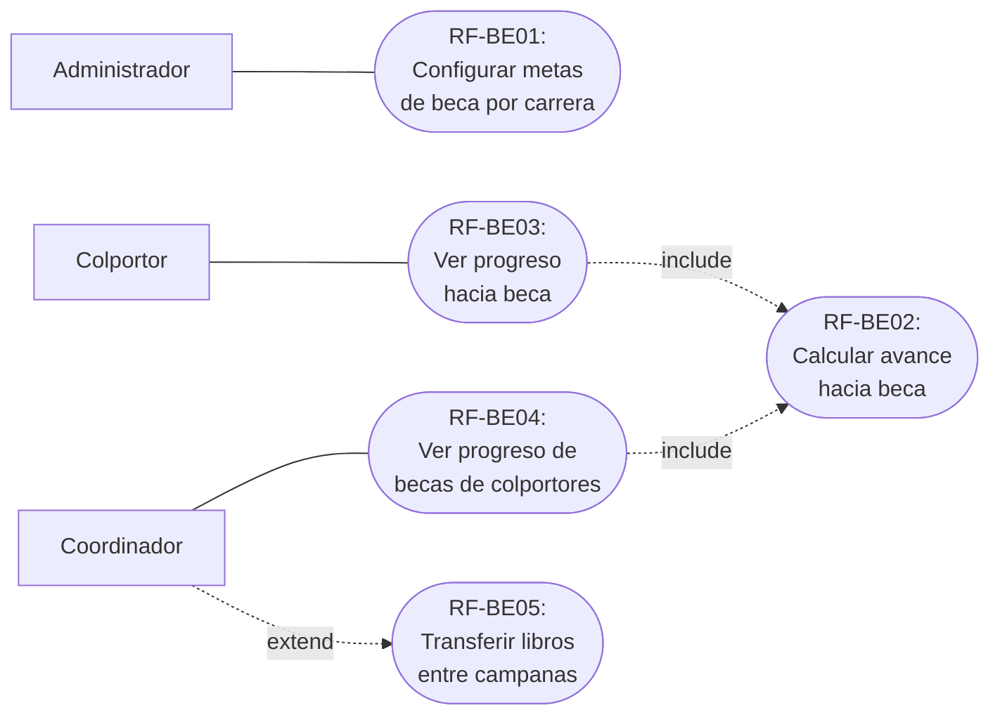
```mermaid
graph LR
    Colportor["Colportor"]
    Coordinador["Coordinador"]
    Administrador["Administrador"]

    UC_BE01(["RF-BE01:<br/>Configurar metas<br/>de beca por carrera"])
    UC_BE02(["RF-BE02:<br/>Calcular avance<br/>hacia beca"])
    UC_BE03(["RF-BE03:<br/>Ver progreso<br/>hacia beca"])
    UC_BE04(["RF-BE04:<br/>Ver progreso de<br/>becas de colportores"])
    UC_BE05(["RF-BE05:<br/>Transferir libros<br/>entre campanas"])

    Administrador --- UC_BE01
    Colportor --- UC_BE03
    Coordinador --- UC_BE04

    UC_BE03 -.->|"include"| UC_BE02
    UC_BE04 -.->|"include"| UC_BE02
    Coordinador -.->|"extend"| UC_BE05
```

---

## 12. Modulo de Reportes y Estadisticas (V1-V2)

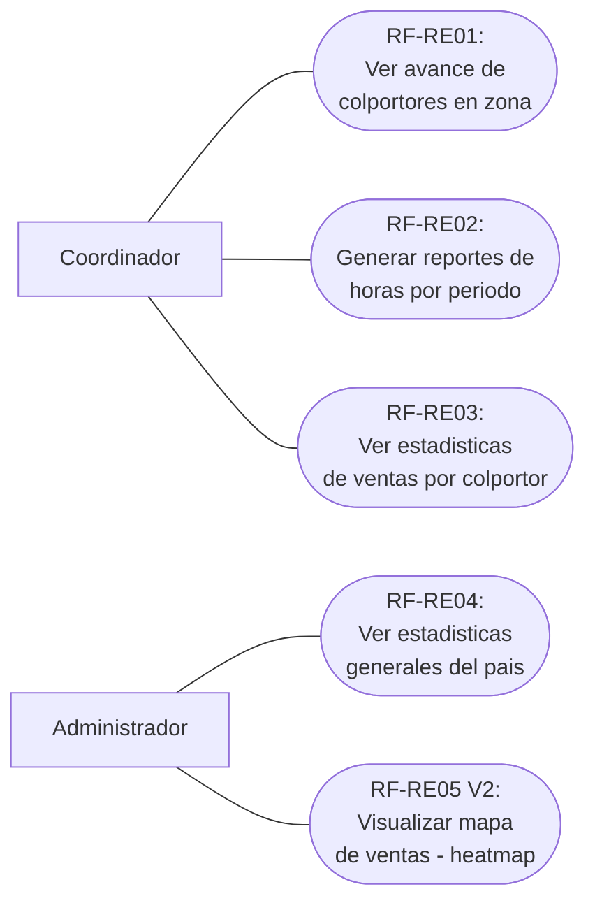
```mermaid
graph LR
    Coordinador["Coordinador"]
    Administrador["Administrador"]

    UC_RE01(["RF-RE01:<br/>Ver avance de<br/>colportores en zona"])
    UC_RE02(["RF-RE02:<br/>Generar reportes de<br/>horas por periodo"])
    UC_RE03(["RF-RE03:<br/>Ver estadisticas<br/>de ventas por colportor"])
    UC_RE04(["RF-RE04:<br/>Ver estadisticas<br/>generales del pais"])
    UC_RE05(["RF-RE05 V2:<br/>Visualizar mapa<br/>de ventas - heatmap"])

    Coordinador --- UC_RE01
    Coordinador --- UC_RE02
    Coordinador --- UC_RE03
    Administrador --- UC_RE04
    Administrador --- UC_RE05
```

---

## 13. Modulo de Notificaciones (V1-V2)

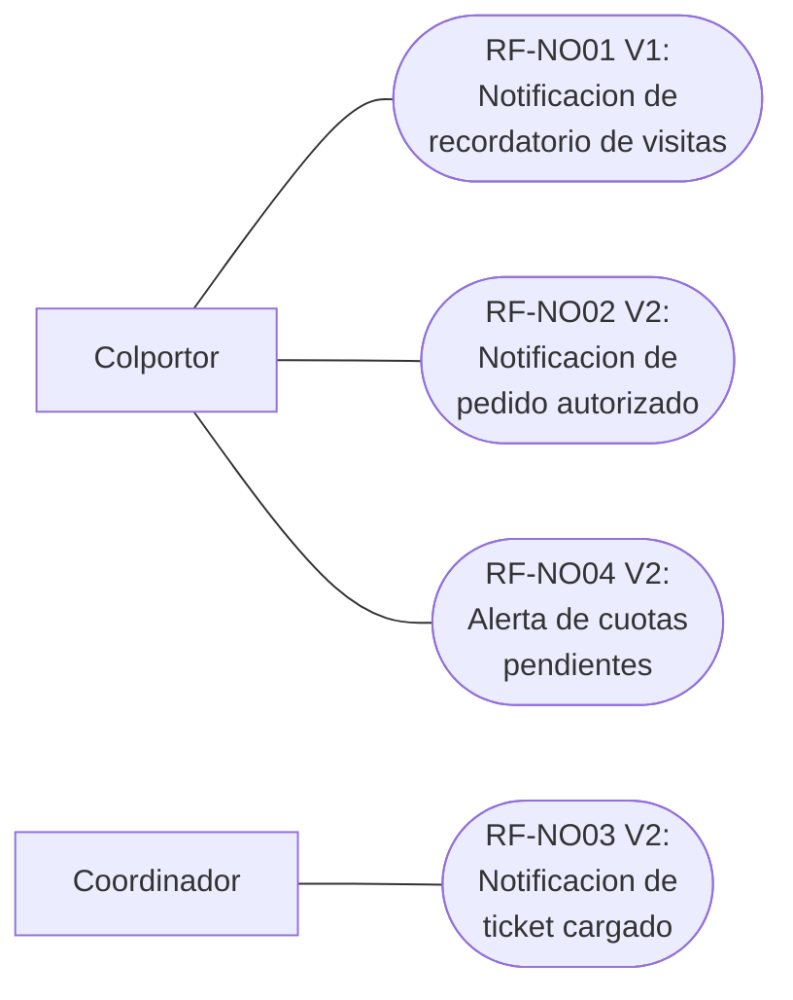
```mermaid
graph LR
    Colportor["Colportor"]
    Coordinador["Coordinador"]

    UC_NO01(["RF-NO01 V1:<br/>Notificacion de<br/>recordatorio de visitas"])
    UC_NO02(["RF-NO02 V2:<br/>Notificacion de<br/>pedido autorizado"])
    UC_NO03(["RF-NO03 V2:<br/>Notificacion de<br/>ticket cargado"])
    UC_NO04(["RF-NO04 V2:<br/>Alerta de cuotas<br/>pendientes"])

    Colportor --- UC_NO01
    Colportor --- UC_NO02
    Colportor --- UC_NO04
    Coordinador --- UC_NO03
```

---

## 14. Modulo de Almacenamiento Local y Backup (V1)

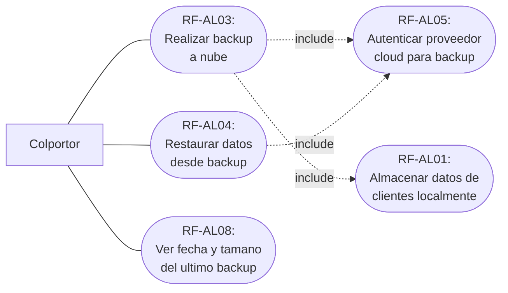
```mermaid
graph LR
    Colportor["Colportor"]

    UC_AL01(["RF-AL01:<br/>Almacenar datos de<br/>clientes localmente"])
    UC_AL03(["RF-AL03:<br/>Realizar backup<br/>a nube"])
    UC_AL04(["RF-AL04:<br/>Restaurar datos<br/>desde backup"])
    UC_AL05(["RF-AL05:<br/>Autenticar proveedor<br/>cloud para backup"])
    UC_AL08(["RF-AL08:<br/>Ver fecha y tamano<br/>del ultimo backup"])

    Colportor --- UC_AL03
    Colportor --- UC_AL04
    Colportor --- UC_AL08

    UC_AL03 -.->|"include"| UC_AL05
    UC_AL04 -.->|"include"| UC_AL05
    UC_AL03 -.->|"include"| UC_AL01
```

---

## 15. Modulo de Sincronizacion (V1)

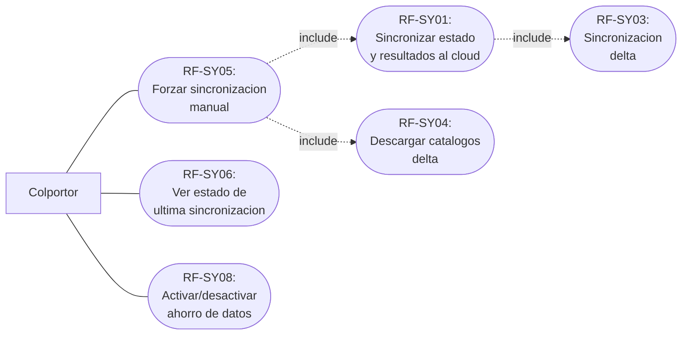
```mermaid
graph LR
    Colportor["Colportor"]

    UC_SY01(["RF-SY01:<br/>Sincronizar estado<br/>y resultados al cloud"])
    UC_SY03(["RF-SY03:<br/>Sincronizacion<br/>delta"])
    UC_SY04(["RF-SY04:<br/>Descargar catalogos<br/>delta"])
    UC_SY05(["RF-SY05:<br/>Forzar sincronizacion<br/>manual"])
    UC_SY06(["RF-SY06:<br/>Ver estado de<br/>ultima sincronizacion"])
    UC_SY08(["RF-SY08:<br/>Activar/desactivar<br/>ahorro de datos"])

    Colportor --- UC_SY05
    Colportor --- UC_SY06
    Colportor --- UC_SY08

    UC_SY05 -.->|"include"| UC_SY01
    UC_SY01 -.->|"include"| UC_SY03
    UC_SY05 -.->|"include"| UC_SY04
```

---

## 16. Modulo de Integracion con Sistema Brasil (V3)

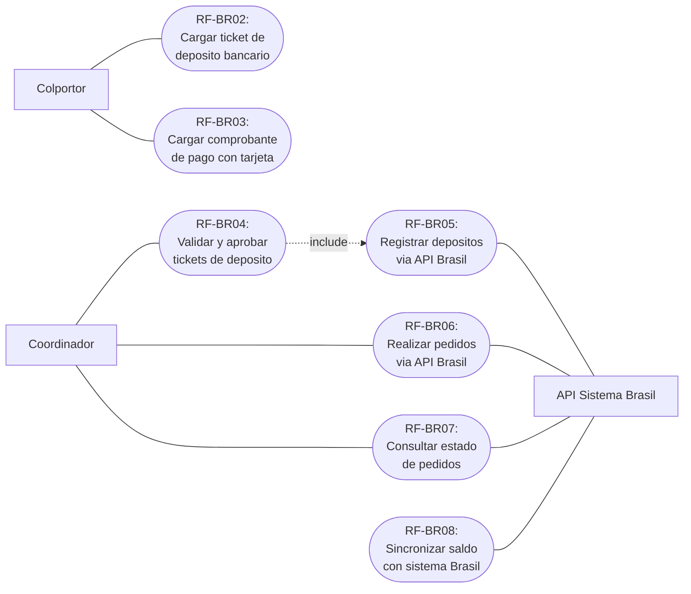
```mermaid
graph LR
    Colportor["Colportor"]
    Coordinador["Coordinador"]
    SistemaBrasil["API Sistema Brasil"]

    UC_BR02(["RF-BR02:<br/>Cargar ticket de<br/>deposito bancario"])
    UC_BR03(["RF-BR03:<br/>Cargar comprobante<br/>de pago con tarjeta"])
    UC_BR04(["RF-BR04:<br/>Validar y aprobar<br/>tickets de deposito"])
    UC_BR05(["RF-BR05:<br/>Registrar depositos<br/>via API Brasil"])
    UC_BR06(["RF-BR06:<br/>Realizar pedidos<br/>via API Brasil"])
    UC_BR07(["RF-BR07:<br/>Consultar estado<br/>de pedidos"])
    UC_BR08(["RF-BR08:<br/>Sincronizar saldo<br/>con sistema Brasil"])

    Colportor --- UC_BR02
    Colportor --- UC_BR03
    Coordinador --- UC_BR04
    Coordinador --- UC_BR06
    Coordinador --- UC_BR07

    UC_BR04 -.->|"include"| UC_BR05
    UC_BR05 --- SistemaBrasil
    UC_BR06 --- SistemaBrasil
    UC_BR07 --- SistemaBrasil
    UC_BR08 --- SistemaBrasil
```

---

## 17. Modulo de Pathing y Optimizacion (V3)

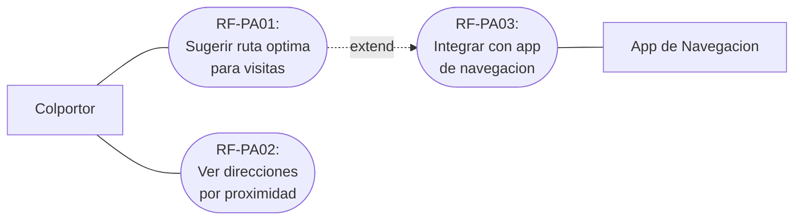
```mermaid
graph LR
    Colportor["Colportor"]
    AppNavegacion["App de Navegacion"]

    UC_PA01(["RF-PA01:<br/>Sugerir ruta optima<br/>para visitas"])
    UC_PA02(["RF-PA02:<br/>Ver direcciones<br/>por proximidad"])
    UC_PA03(["RF-PA03:<br/>Integrar con app<br/>de navegacion"])

    Colportor --- UC_PA01
    Colportor --- UC_PA02

    UC_PA01 -.->|"extend"| UC_PA03
    UC_PA03 --- AppNavegacion
```

---

## 18. Modulo de Finanzas Personales (V3)

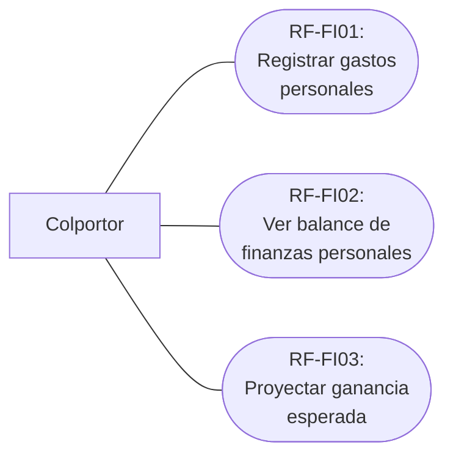
```mermaid
graph LR
    Colportor["Colportor"]

    UC_FI01(["RF-FI01:<br/>Registrar gastos<br/>personales"])
    UC_FI02(["RF-FI02:<br/>Ver balance de<br/>finanzas personales"])
    UC_FI03(["RF-FI03:<br/>Proyectar ganancia<br/>esperada"])

    Colportor --- UC_FI01
    Colportor --- UC_FI02
    Colportor --- UC_FI03
```

---

## Diagrama Resumen de Paquetes

```mermaid
graph TB
    subgraph "Colportaje App - Paquetes de Casos de Uso"
        PKG_AUTH["Autenticacion<br/>y Usuarios V1"]
        PKG_UBIC["Gestion de<br/>Ubicaciones V1"]
        PKG_VISIT["Visitas y<br/>Agenda V1"]
        PKG_VENT["Ventas y<br/>Entregas V1-V2"]
        PKG_COBR["Cobranzas<br/>V1-V2"]
        PKG_JORN["Jornada<br/>Laboral V1"]
        PKG_CAMP["Campanas y<br/>Zonas V1"]
        PKG_PREC["Precios y<br/>Catalogo V1"]
        PKG_STOCK["Stock V2"]
        PKG_CUENTA["Estado de<br/>Cuenta V2"]
        PKG_BECAS["Becas V2"]
        PKG_REPORT["Reportes y<br/>Estadisticas V1-V2"]
        PKG_NOTIF["Notificaciones<br/>V1-V2"]
        PKG_LOCAL["Almacenamiento<br/>Local y Backup V1"]
        PKG_SYNC["Sincronizacion<br/>V1"]
        PKG_BRASIL["Integracion<br/>Sistema Brasil V3"]
        PKG_PATH["Pathing y<br/>Optimizacion V3"]
        PKG_FIN["Finanzas<br/>Personales V3"]
    end

    Guest["Guest"] --> PKG_AUTH
    Colportor["Colportor"] --> PKG_UBIC
    Colportor --> PKG_VISIT
    Colportor --> PKG_VENT
    Colportor --> PKG_COBR
    Colportor --> PKG_JORN
    Colportor --> PKG_CAMP
    Colportor --> PKG_LOCAL
    Colportor --> PKG_SYNC
    Colportor --> PKG_PATH
    Colportor --> PKG_FIN
    Coordinador["Coordinador"] --> PKG_CAMP
    Coordinador --> PKG_STOCK
    Coordinador --> PKG_CUENTA
    Coordinador --> PKG_BECAS
    Coordinador --> PKG_REPORT
    Coordinador --> PKG_BRASIL
    Administrador["Administrador"] --> PKG_PREC
    Administrador --> PKG_REPORT
    Administrador --> PKG_CAMP
```

---

*Documento generado a partir del IEEE 830 v1.2 - Colportaje App y la guia UML Capitulo III - Casos de Uso*
